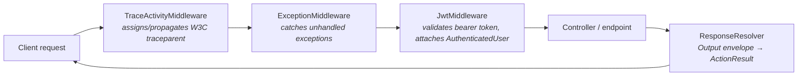

+++
title = 'Dotnet WebApi Util'
+++

# Documentation

**`ArturRios.Util.WebApi`** is a set of building blocks for ASP.NET Core web APIs in .NET. It bundles a
base class for bootstrapping the host (configuration, logging, Swagger, middleware pipeline),
stateless-or-revalidating JWT authentication with role-based authorization, cross-cutting middleware for
exceptions and distributed tracing, a thin typed-`HttpClient` base for calling other services, and a
resolver that turns `ArturRios.Output` envelopes into `ActionResult`s.

## Request pipeline

A typical request set up with the built-in middlewares flows through tracing, exception handling and
authentication before it reaches your endpoint:



## Feature areas

| Area | What it does | Docs |
|---|---|---|
| Configuration / bootstrap | `WebApiStartup` wires up configuration loading, logging, Swagger and the middleware pipeline behind a small set of virtual hooks; `WebApiParameters` parses command-line startup args. | [Configuration](/configuration/) |
| Security (JWT + roles) | `JwtMiddleware` validates the bearer token and attaches an `AuthenticatedUser`, in stateless (`ClaimsOnly`) or per-request-revalidated mode; `[Authorize]`, `[AllowAnonymous]` and `[RoleRequirement(...)]` declare access rules. | [Security](/security/) |
| Middleware & diagnostics | `ExceptionMiddleware` converts unhandled exceptions into a JSON error envelope; `TraceActivityMiddleware` and `TracePropagationHandler` propagate a W3C `traceparent` across a request and its outgoing calls. | [Middleware & Diagnostics](/middleware-and-diagnostics/) |
| HTTP client | `BaseWebApiClient` / `BaseWebApiClientRoute` give a typed client a shared `HttpGateway`, route grouping, and helpers to authenticate and carry the resulting bearer token on subsequent calls. | [HTTP Client](/http-client/) |
| Responses | `ResponseResolver.Resolve(...)` wraps `DataOutput<T>`, `PaginatedOutput<T>` and `ProcessOutput` in an `ActionResult`, defaulting to 200/400 based on `Success` unless a status code is supplied. | [Responses](/responses/) |
| Endpoint toggling | `[EndpointToggle]` enables or disables a single endpoint from a compile-time flag or a runtime `appsettings.json`/environment-variable value, shaping the disabled response as an empty status code, the action's default value, a `ProcessOutput` envelope, or a thrown `EndpointDisabledException`. | [Endpoint Toggling](/endpoint-toggle/) |

## Installation

Requires **.NET 10** or later.

```bash
dotnet add package ArturRios.Util.WebApi
```

## The result envelope

Endpoints return an `ArturRios.Output` envelope — `DataOutput<T>` (data + success/errors) or, for
operations with no payload, `ProcessOutput` — and `ResponseResolver` maps that envelope onto an
`ActionResult`, so success and failure both flow through the same, predictable shape instead of thrown
exceptions.

## Where to next

- **[Architecture](/dotnet-webapi-util/architecture)** — how the pieces above fit together and the design principles
  behind them.
- **[Configuration](/dotnet-webapi-util/configuration)** — bootstrapping a host with `WebApiStartup` and `WebApiParameters`.
- **[Security](/dotnet-webapi-util/security)** — JWT validation modes, cached revalidation, and role-based authorization.
- **[Middleware & Diagnostics](/dotnet-webapi-util/middleware-and-diagnostics)** — exception handling and distributed
  tracing.
- **[HTTP Client](/dotnet-webapi-util/http-client)** — building typed clients on top of `BaseWebApiClient`.
- **[Responses](/dotnet-webapi-util/responses)** — resolving `ArturRios.Output` envelopes into `ActionResult`s.
- **[Endpoint Toggling](/dotnet-webapi-util/endpoint-toggle)** — enabling or disabling individual endpoints from code or
  configuration.

The source lives at [github.com/artur-rios/dotnet-webapi-util](https://github.com/artur-rios/dotnet-webapi-util),
licensed under the MIT License.
