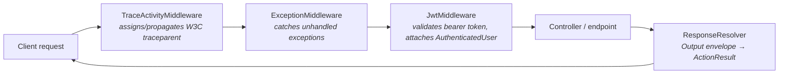
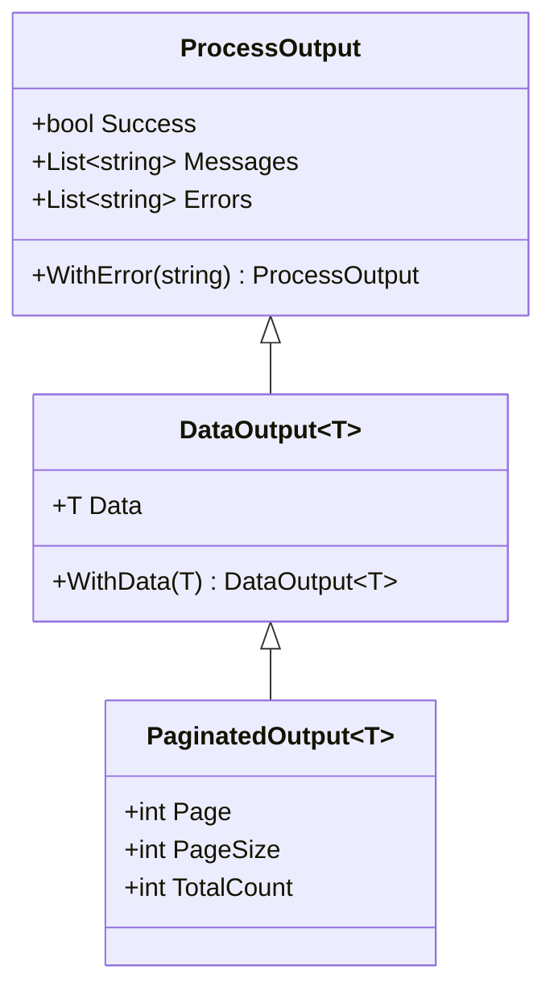

+++
title = 'Architecture'
+++

# Architecture

This page shows how the pieces of `ArturRios.Util.WebApi` fit together: the request pipeline, the
security model, the response envelope, and the design principles that hold them together.

## Request pipeline

The library is a thin layer around the standard ASP.NET Core pipeline. `WebApiStartup` builds the
`WebApplicationBuilder`/`WebApplication` and exposes `AddMiddlewares(Type[])`, which registers each given
middleware type on the app **in the order supplied**, skipping any type that isn't a `WebApiMiddleware`.
A typical setup registers the three built-in middlewares in this order:



`WebApiMiddleware` is an abstract marker base class with no members — its only job is to let
`AddMiddlewares` recognize which types are safe to register with `App.UseMiddleware(...)`:

```csharp
AddMiddlewares([
    typeof(TraceActivityMiddleware),
    typeof(ExceptionMiddleware),
    typeof(JwtMiddleware)
]);
```

Because registration order is registration order, `TraceActivityMiddleware` runs first so the trace id
is available to everything downstream (including exception logging), `ExceptionMiddleware` runs next so
it can catch exceptions thrown by authentication or the endpoint itself, and `JwtMiddleware` runs last of
the three so only requests that pass tracing/exception setup pay for token validation.

See [Middleware & Diagnostics](/middleware-and-diagnostics/) for what `TraceActivityMiddleware` and
`ExceptionMiddleware` do in detail, and [Configuration](/configuration/) for the full `WebApiStartup`
lifecycle.

## Security model

`JwtMiddleware` validates the bearer token on every request that isn't a Swagger route or an
`[AllowAnonymous]` endpoint. What happens next depends on `JwtAuthenticationOptions.ValidationMode`:

```mermaid
flowchart TB
    Token["Bearer token"] --> Verify{"Signature valid?"}
    Verify -- "no" --> R401["401 Unauthorized"]
    Verify -- "yes" --> Mode{"ValidationMode"}

    Mode -- "ClaimsOnly (default)" --> Claims["AuthenticatedUserFactory.FromToken<br/><i>id + role claims, no lookup</i>"]
    Mode -- "Revalidate" --> Provider["IAuthenticationProvider.GetAuthenticatedUserById<br/><i>resolved per-request from RequestServices</i>"]

    Provider -.-> Cached["CachedAuthenticationProvider<br/><i>IMemoryCache, Ttl / CacheMisses</i>"]
    Cached -.-> Provider

    Claims --> Items["HttpContext.Items[\"User\"]"]
    Provider --> Items

    Items --> Authorize["AuthorizeAttribute<br/><i>401 if no user</i>"]
    Authorize --> RoleReq["RoleRequirementFilter<br/><i>403 if role not authorized</i>"]
    RoleReq --> Endpoint["Controller action"]
```

`ClaimsOnly` (the default) never touches a data store — the user is rebuilt straight from the token's
`id` and `role` claims, so authentication costs nothing beyond the signature check. `Revalidate` instead
resolves `IAuthenticationProvider` from the current request's `HttpContext.RequestServices` and calls
`GetAuthenticatedUserById` on every request, trading a lookup for freshness. `CachedAuthenticationProvider`
sits transparently in front of any `IAuthenticationProvider` (registered via
`AddCachedAuthenticationProvider<T>`) to absorb repeated lookups of the same user within a short TTL,
without either mode needing to know it's there.

`AuthorizeAttribute` and `RoleRequirementFilter` both read the same `HttpContext.Items["User"]` slot that
`JwtMiddleware` populates, and both honor `[AllowAnonymous]` by short-circuiting before checking it.

See [Security](/security/) for the full authentication and authorization reference.

## Response envelopes

Endpoints return an `ArturRios.Output` envelope rather than throwing on failure. `ProcessOutput` carries
success/error/message state; `DataOutput<T>` adds a typed payload on top of it:



`ResponseResolver.Resolve(...)` maps any of `ProcessOutput`, `DataOutput<T>` or `PaginatedOutput<T>` onto
an `ActionResult`, defaulting the HTTP status to 200 when `Success` is `true` and 400 otherwise, unless an
explicit `statusCode` is supplied:

```csharp
[HttpGet("{id:int}")]
public ActionResult<DataOutput<UserDto?>> GetById(int id)
{
    DataOutput<UserDto?> output = _userService.GetById(id);

    return ResponseResolver.Resolve(output);
}
```

See [Responses](/responses/) for the full mapping reference.

## Design principles

- **Envelopes, not exceptions.** Endpoints report failure through `ProcessOutput`/`DataOutput<T>` and let
  `ResponseResolver` pick the status code; `ExceptionMiddleware` is the safety net for anything that still
  escapes as a thrown exception, not the primary error-reporting path.
- **Stateless by default, revalidating when you need it.** `JwtValidationMode.ClaimsOnly` is the default
  because most requests don't need a fresh database read on every call; `Revalidate` (optionally cached)
  is there for the cases where staleness — instead of an expired token — is the risk you can't accept.
- **Small, focused middlewares.** Each of `TraceActivityMiddleware`, `ExceptionMiddleware` and
  `JwtMiddleware` does exactly one thing and derives from the `WebApiMiddleware` marker so it can be
  composed via `AddMiddlewares` in whatever order a given host needs.
- **Consistent `InvokeAsync`.** Every middleware follows the standard ASP.NET Core convention — a
  constructor capturing `RequestDelegate next` plus other dependencies, and a single `InvokeAsync(HttpContext)`
  method — so custom middlewares slot into `AddMiddlewares` the same way the built-in ones do.
- **DI-first.** Dependencies such as `IAuthenticationProvider`, `JwtAuthenticationOptions` and
  `SettingsProvider` are resolved through the container (constructor injection or, for per-request
  freshness, `HttpContext.RequestServices`) rather than passed around manually.

## Where to next

- **[Configuration](/configuration/)** — the `WebApiStartup` lifecycle and `WebApiParameters`.
- **[Security](/security/)** — JWT validation modes, caching, and role-based authorization in depth.
- **[Middleware & Diagnostics](/middleware-and-diagnostics/)** — exception handling and distributed
  tracing.
- **[HTTP Client](/http-client/)** — building typed clients on top of `BaseWebApiClient`.
- **[Responses](/responses/)** — the full `ResponseResolver` mapping reference.
