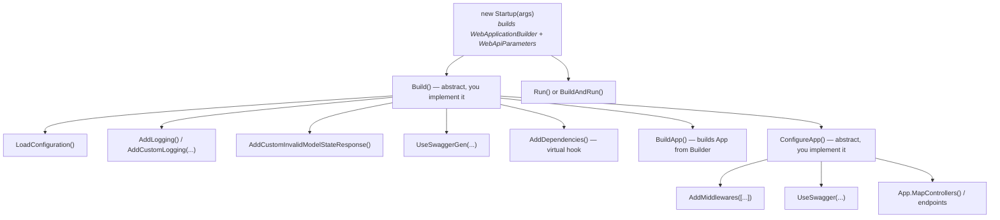

+++
title = 'Configuration'
+++

# Configuration

`WebApiStartup` is the abstract base class you derive from to bootstrap an ASP.NET Core host:
configuration loading, logging, Swagger, the middleware pipeline and the invalid-model-state response all
go through a small set of methods on it, some of which you must implement and some of which are optional
hooks.

## The lifecycle



`Build()` and `ConfigureApp()` are **abstract** — you must implement both. Everything else on
`WebApiStartup` is either a plain helper method you call from inside them, or a **virtual no-op hook**
you can override:

| Member | Kind | Purpose |
|---|---|---|
| `Build()` | abstract | The full startup sequence: configuration, services, `BuildApp()`, then `ConfigureApp()`. |
| `ConfigureApp()` | abstract | Configures the built `App`'s request pipeline (middlewares, Swagger UI, endpoint mapping). |
| `AddDependencies()` | virtual hook | Override to register your own services. No-op by default. |
| `ConfigureCors()` | virtual hook | Override to enable and configure CORS. No-op by default. |
| `ConfigureSecurity()` | virtual hook | Override to configure authentication/authorization services. No-op by default. |
| `ConfigureWebApi()` | virtual hook | Override to configure web-API-specific services (controllers, filters, etc). No-op by default. |
| `StartServices()` | virtual hook | Override to start background/hosted services. No-op by default. |
| `LoadConfiguration()` | helper | Loads `appsettings`/env file per `WebApiParameters` and registers `SettingsProvider`/`EnvironmentProvider`. |
| `AddLogging()` | helper | Adds the default ASP.NET Core logging services. |
| `AddCustomLogging(loggerConfigurations)` | helper | Replaces the default logging providers with a custom logger built from the given configurations. |
| `AddMiddlewares(Type[])` | helper | Registers each given middleware type on `App`, in order, skipping any type that isn't a `WebApiMiddleware`. |
| `AddCustomInvalidModelStateResponse()` | helper | Replaces ASP.NET Core's default invalid-model-state response with a `DataOutput<string>`-shaped 400. |
| `UseSwaggerGen(...)` | helper | Registers the Swagger generator, conditionally on the current environment. |
| `UseSwagger(...)` | helper | Enables the Swagger middleware (JSON + UI), conditionally on the current environment. |
| `BuildApp()` | helper | Builds `App` from `Builder`. Must run before `ConfigureApp()` touches `App`. |
| `Run()` / `BuildAndRun()` | helper | Runs the built app, or calls `Build()` then `Run()` in one call. |

## A minimal `Startup`

```csharp
public class Startup(string[] args) : WebApiStartup(args)
{
    public override void Build()
    {
        LoadConfiguration();
        AddLogging();
        AddCustomInvalidModelStateResponse();
        UseSwaggerGen(jwtAuthentication: true);
        Builder.Services.AddControllers();

        AddDependencies();

        BuildApp();
        ConfigureApp();
    }

    public override void ConfigureApp()
    {
        AddMiddlewares([
            typeof(TraceActivityMiddleware),
            typeof(ExceptionMiddleware),
            typeof(JwtMiddleware)
        ]);

        UseSwagger();
        App.MapControllers();
    }
}

new Startup(args).BuildAndRun();
```

`BuildApp()` must run before `ConfigureApp()`, since the pipeline configuration in `ConfigureApp()`
(`AddMiddlewares`, `UseSwagger`, endpoint mapping) operates on the built `App`, not the `Builder`.

## `WebApiParameters` — command-line startup args

`WebApiParameters` parses the process's `args` into a small set of properties, without any code changes
required at the call site. Each argument is a `Key:Value` pair; unrecognized or malformed entries are
silently ignored, leaving the default in place:

| Argument | Property | Default | Effect |
|---|---|---|---|
| `Environment:<name>` | `EnvironmentName` | `""` | Sets the environment name, if it's a valid `EnvironmentType` value. |
| `UseAppSetting:<bool>` | `UseAppSettings` | `true` | Whether `LoadConfiguration()` loads `appsettings.json`. |
| `UseEnvFile:<bool>` | `UseEnvFile` | `true` | Whether `LoadConfiguration()` loads a `.env` file. |
| `SwaggerEnvironments:[A,B]` | `SwaggerEnvironments` | `[]` | The environment names in which Swagger is served (see below). |

For example:

```
Environment:Production UseAppSetting:false UseEnvFile:false SwaggerEnvironments:[Development,Staging]
```

## Swagger — enabled per environment

Swagger is gated by **environment name**, not by a simple on/off flag. `UseSwagger(allowedEnvironments)`
and `UseSwaggerGen(allowedEnvironments, ...)` each decide whether to activate using this precedence:

1. The `allowedEnvironments` parameter passed directly to the call, if non-empty.
2. Otherwise, `WebApiParameters.GetSwaggerEnvironments()` — the `SwaggerEnvironments:[...]` CLI arg, if it
   parsed to at least one valid environment name.
3. Otherwise, the built-in default: `Development` and `Local`.

```csharp
UseSwaggerGen(jwtAuthentication: true); // uses the default/CLI-configured environments
UseSwagger([EnvironmentType.Development, EnvironmentType.Staging]); // explicit override
```

Because `GetSwaggerEnvironments()` always falls back to `[Development, Local]` rather than returning an
empty list, in practice Swagger's on/off state is always decided by one of the first two rules — there
is no separate `appsettings.json` toggle you need to flip to turn Swagger on or off.

`AppSettingsKeys.SwaggerEnabled` (`"Swagger:Enabled"`) is a separate internal marker, and it is set only
when you pass an explicit `SwaggerEnvironments:[...]` argument that includes the current environment
(the marker uses the raw argument, not the `[Development, Local]` fallback). `JwtMiddleware` reads this
marker to recognize `/swagger` routes and skip authentication on them. This means Swagger can be *served*
by default in `Development`/`Local` without the marker being set — in that case the `/swagger`
authentication bypass is not active unless you also pass the matching `SwaggerEnvironments:[...]`
argument.

## Logging

`AddLogging()` wires up the default ASP.NET Core logging providers. `AddCustomLogging(loggerConfigurations)`
instead clears the default providers and registers a custom logger (backed by `IStateLogger`) built from
the given `LoggerConfiguration` list, with the minimum level set to `Trace`. Use one or the other, not
both.

## Invalid model state

`AddCustomInvalidModelStateResponse()` replaces ASP.NET Core's built-in `[ApiController]` validation
response with a `DataOutput<string>`-shaped 400: each invalid model-binding parameter is turned into an
error message of the form `Parameter: <name> | Error: <message>`, collected on the envelope's `Errors`
list, so validation failures come back in the same shape as any other failed `ResponseResolver.Resolve`
call.

## Where to next

- **[Architecture](/architecture/)** — how the pipeline, security model and response envelopes fit
  together.
- **[Security](/security/)** — `ConfigureSecurity()`, JWT validation modes, and role-based authorization.
- **[Middleware & Diagnostics](/middleware-and-diagnostics/)** — the built-in middlewares registered via
  `AddMiddlewares`.
- **[Responses](/responses/)** — `ResponseResolver` and the invalid-model-state envelope shape.
