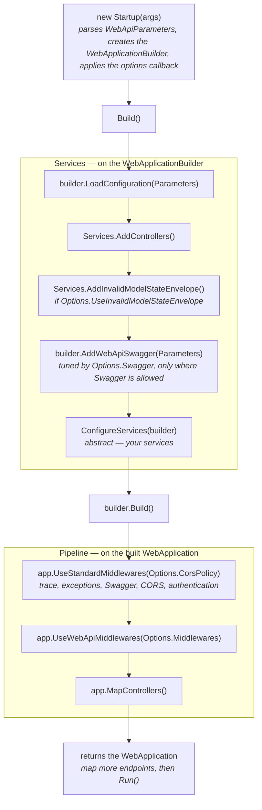

`WebApiStartup` is the abstract base class you derive from to bootstrap an ASP.NET Core host: it runs one
standard, opinionated sequence — configuration loading, controllers, the invalid-model-state envelope,
Swagger, the standard middlewares and controller mapping — and leaves you a single method to implement,
`ConfigureServices`, for your own services. The sequence is tuned through `WebApiStartupOptions`, and every
step in it is also a public extension method, so the same setup can be composed on a plain
`WebApplicationBuilder` without the base class.

## The lifecycle



`Build()` runs these steps in this order, every time:

| # | Step | What it does | Tuned by |
|---|---|---|---|
| 1 | `Builder.LoadConfiguration(Parameters)` | Loads `appsettings` and/or the `.env` file per `WebApiParameters`; registers `WebApiParameters`, `ConfigurationLoader` and `SettingsProvider` (always — `AuthenticationMiddleware` needs it), plus `EnvironmentProvider` when the env file is loaded. | `UseAppSettings:` / `UseEnvFile:` args |
| 2 | `Builder.Services.AddControllers()` | Registers MVC controllers. | — |
| 3 | `Builder.Services.AddInvalidModelStateEnvelope()` | Answers invalid model state with a `DataOutput<string>`-shaped 400 (see [Invalid model state](#invalid-model-state)). | `Options.UseInvalidModelStateEnvelope` |
| 4 | `Builder.AddWebApiSwagger(Parameters, …)` | Registers the Swagger generator, only in environments where Swagger is allowed, and sets the `Swagger:Enabled` marker. | `Options.Swagger`, `EnableSwaggerDocs:` / `SwaggerEnvironments:` args |
| 5 | `ConfigureServices(builder)` | **Your** services: data access, handlers, `AddTokenAuthentication`, `AddCors`, hosted services, logging, and so on. | your override |
| 6 | `Builder.Build()` | Builds the `WebApplication`. | — |
| 7 | `app.UseStandardMiddlewares(Options.CorsPolicy)` | `UseForwardedHeaders` (a no-op until `ForwardedHeadersOptions` is configured), `TraceActivityMiddleware`, `ExceptionMiddleware`, Swagger (only if step 4 registered the generator), `UseCors` (only if a policy is named), then `AuthenticationMiddleware` (only if `AddTokenAuthentication` was called). Swagger and CORS run before authentication, so the Swagger UI and CORS preflight requests never need a token. | `Options.CorsPolicy`, whether `AddTokenAuthentication` was registered |
| 8 | `app.UseWebApiMiddlewares(Options.Middlewares)` | Your extra `WebApiMiddleware` types, in order, after the standard ones. | `Options.Middlewares` |
| 9 | `app.MapControllers()` | Maps the controller endpoints. | — |

The members of `WebApiStartup` are:

| Member | Kind | Purpose |
|---|---|---|
| `WebApiStartup(string[] args)` | protected constructor | Parses `args` into `Parameters` and creates `Builder`, with the default options. |
| `WebApiStartup(string[] args, Action<WebApiStartupOptions> configure)` | protected constructor | The same, then tunes the sequence through `configure`. |
| `Parameters` | protected property | The `WebApiParameters` parsed from `args`. |
| `Options` | protected property | The `WebApiStartupOptions` tuning the sequence. |
| `Builder` | protected property | The `WebApplicationBuilder`; its environment is `Parameters.EnvironmentName` when one was supplied. |
| `ConfigureServices(WebApplicationBuilder builder)` | abstract | The one method you implement: register your own services. Runs after the standard services, before the app is built. |
| `Build()` | public | Runs the standard sequence and returns the built `WebApplication`. Can be called only once. |
| `Run()` / `RunAsync()` | public | Calls `Build()` and runs the app until it shuts down. |

## A minimal `Startup`

```csharp
public class Startup(string[] args) : WebApiStartup(args, options =>
{
    options.Swagger.JwtAuthentication = true;
    options.Middlewares.Add(typeof(MyMiddleware));
})
{
    protected override void ConfigureServices(WebApplicationBuilder builder)
    {
        builder.Services.AddTokenAuthentication(_ => { }); // see Security
        builder.Services.AddHealthChecks();
        builder.Services.AddScoped<IMyService, MyService>();
    }
}

var app = new Startup(args).Build();
app.MapHealthChecks("/health");
app.Run();
```

`AddTokenAuthentication` validates its options as soon as it's called. The one check it can't make there —
`ValidateIssuer`/`ValidateAudience` on while `JwtConfiguration.Issuer`/`Audience` is blank, since
`JwtConfiguration` is registered separately — runs when the pipeline is built, so `Run()`/`RunAsync()` (or
`app.StartAsync()`) throws an `InvalidOperationException` before the app serves anything. See
[Security](../security/#issuer-and-audience).

`Build()` returns the `WebApplication`, so endpoints beyond the controllers — health checks, minimal APIs —
are mapped on it before it runs. When there's nothing extra to map, `new Startup(args).Run()` (or
`await new Startup(args).RunAsync()`) builds and runs in one call.

There is no need to list `TraceActivityMiddleware`, `ExceptionMiddleware` or `AuthenticationMiddleware`:
the standard sequence adds them, `AuthenticationMiddleware` as soon as `AddTokenAuthentication` has been
called. `Options.Middlewares` is only for **additional** `WebApiMiddleware` types; a type that doesn't
derive from `WebApiMiddleware` makes `Build()` throw an `ArgumentException`. Pipeline steps that aren't
`WebApiMiddleware`s (ASP.NET Core's own `UseRateLimiter`, ...) can be added on the returned app, where they
run after the standard and extra middlewares and before the endpoints; when you need them anywhere else,
compose the pipeline yourself, as below. CORS is the exception, since it must run before authentication:
register the policy with `AddCors` in `ConfigureServices` and name it in `Options.CorsPolicy`.

### `WebApiStartupOptions`

| Option | Type | Default | Effect |
|---|---|---|---|
| `Swagger.AllowedEnvironments` | `EnvironmentType[]` | `[]` | The environments in which Swagger is generated and served. When empty, the `SwaggerEnvironments:[...]` arg decides, falling back to `Development` and `Local` (see [Swagger](#swagger--enabled-per-environment)). |
| `Swagger.JwtAuthentication` | `bool` | `false` | Declares a JWT bearer security scheme in the document, so Swagger UI offers an "Authorize" button. |
| `Swagger.ConfigureGenerator` | `Action<SwaggerGenOptions>?` | `null` | Further configures the Swagger generator (documents, filters, XML comments). |
| `TraceActivity.LogClientIp` | `bool` | `true` | Whether `TraceActivityMiddleware` includes the client's IP address in its "Started request" log entry (see [The client IP address](../middleware-and-diagnostics/#the-client-ip-address)). |
| `TraceActivity.TagClientAddress` | `bool` | `true` | Whether `TraceActivityMiddleware` tags the client's IP address on the request's activity as `client.address`. |
| `UseInvalidModelStateEnvelope` | `bool` | `true` | Whether invalid model state is answered with the `DataOutput` envelope; `false` keeps ASP.NET Core's `ProblemDetails`. |
| `CorsPolicy` | `string?` | `null` | Name of a CORS policy registered with `AddCors` in `ConfigureServices`; applied before authentication so preflight requests pass. |
| `Middlewares` | `List<Type>` | empty | Extra `WebApiMiddleware` types, run in order after the standard middlewares and before the endpoints. |

### Without the base class

Every step of the sequence is a public extension method in `ArturRios.Util.WebApi.Configuration`, so the
same application can be set up on a plain `WebApplicationBuilder` — useful when you need a different order,
or to skip or replace a step:

```csharp
var parameters = new WebApiParameters(args);
var builder = WebApplication.CreateBuilder(parameters.ToWebApplicationOptions());

builder.LoadConfiguration(parameters);
builder.Services.AddControllers();
builder.Services.AddInvalidModelStateEnvelope();
builder.AddWebApiSwagger(parameters, swagger => swagger.JwtAuthentication = true);

builder.Services.AddTokenAuthentication(_ => { }); // see Security
builder.Services.AddHealthChecks();
builder.Services.AddScoped<IMyService, MyService>();

var app = builder.Build();

app.UseStandardMiddlewares(); // pass a CORS policy name to apply one before authentication
app.UseWebApiMiddlewares(typeof(MyMiddleware));
app.MapControllers();
app.MapHealthChecks("/health");

app.Run();
```

| Extension | On | Purpose |
|---|---|---|
| `LoadConfiguration(WebApiParameters)` | `WebApplicationBuilder` | Loads `appsettings`/the env file per the parameters and registers `WebApiParameters`, `ConfigurationLoader`, `SettingsProvider` and (when the env file is loaded) `EnvironmentProvider`. |
| `AddWebApiSwagger(WebApiParameters, Action<WebApiSwaggerOptions>?)` | `WebApplicationBuilder` | Registers the Swagger generator only when Swagger is allowed in the current environment, and sets the `Swagger:Enabled` marker for the `AuthenticationMiddleware` bypass. |
| `AddInvalidModelStateEnvelope()` | `IServiceCollection` | Replaces the default invalid-model-state response with a `DataOutput<string>`-shaped 400. |
| `UseStandardMiddlewares(corsPolicy?)` | `IApplicationBuilder` | `UseForwardedHeaders` (no-op until configured), `TraceActivityMiddleware`, `ExceptionMiddleware`, Swagger (if the generator was registered), `UseCors` (if a policy is named), then `AuthenticationMiddleware` if `AddTokenAuthentication` was registered. |
| `UseWebApiSwagger()` | `IApplicationBuilder` | Serves the Swagger JSON and UI only if the generator was registered, so the generator and the UI can never disagree. Already part of `UseStandardMiddlewares`; call it alone only when composing the pipeline piece by piece. |
| `UseWebApiMiddlewares(params IEnumerable<Type>)` | `IApplicationBuilder` | Registers each `WebApiMiddleware` type, in order; throws an `ArgumentException` for any other type, before registering anything. |

Pass `parameters.ToWebApplicationOptions()` to `WebApplication.CreateBuilder`, as above — that is what
applies an `Environment:<name>` argument as the host environment. `UseWebApiMiddlewares` replaces the
extension of the same name that used to live in the `ArturRios.Util.WebApi.Extensions` namespace.

## `WebApiParameters` — command-line startup args

`WebApiParameters` parses the process's `args` into a small set of properties, without any code changes
required at the call site. Each argument is a `Key:Value` pair with a case-insensitive key; unrecognized
or malformed entries are silently ignored, leaving the default in place:

| Argument | Property | Default | Effect |
|---|---|---|---|
| `Environment:<name>` | `EnvironmentName` | `""` | Sets the environment name, if it's a valid `EnvironmentType` value, and applies it as the host environment through `ToWebApplicationOptions()` (overriding `ASPNETCORE_ENVIRONMENT`). |
| `UseAppSettings:<bool>` | `UseAppSettings` | `true` | Whether `LoadConfiguration` loads `appsettings.json`. The legacy spelling `UseAppSetting` is still accepted. |
| `UseEnvFile:<bool>` | `UseEnvFile` | `true` | Whether `LoadConfiguration` loads a `.env` file. |
| `EnableSwaggerDocs:<bool>` | `EnableSwaggerDocs` | `true` | `false` disables Swagger (generation and UI) in every environment, whatever else is configured. |
| `SwaggerEnvironments:[A,B]` | `SwaggerEnvironments` | `[]` | The environment names in which Swagger is served (see below). |

For example:

```
Environment:Production UseAppSettings:false UseEnvFile:false SwaggerEnvironments:[Development,Staging]
```

Besides the parsed properties, `WebApiParameters` exposes:

- **`Args`** — the original arguments it was parsed from.
- **`ToWebApplicationOptions()`** — the `WebApplicationOptions` to pass to `WebApplication.CreateBuilder`:
  the original `Args`, and `EnvironmentName` as the environment when one was supplied. `WebApiStartup`
  creates its builder this way.
- **`IsSwaggerAllowed(environmentName, allowedEnvironments?)`** — whether Swagger is allowed in the given
  environment, by the rules below.
- **`GetSwaggerEnvironments()`** — the parsed `SwaggerEnvironments`, falling back to `Development` and
  `Local`.

## Swagger — enabled per environment

Swagger is gated by **environment name**, not by a simple on/off flag. `AddWebApiSwagger` decides whether
to register the generator with `WebApiParameters.IsSwaggerAllowed`, using this precedence:

1. The `EnableSwaggerDocs:false` CLI arg, if supplied, is a kill switch: Swagger is off in every
   environment and nothing below is consulted.
2. `WebApiSwaggerOptions.AllowedEnvironments` (`options.Swagger.AllowedEnvironments` on `WebApiStartup`),
   if non-empty.
3. Otherwise, `WebApiParameters.GetSwaggerEnvironments()` — the `SwaggerEnvironments:[...]` CLI arg, if it
   parsed to at least one valid environment name.
4. Otherwise, the built-in default: `Development` and `Local`.

```csharp
public class Startup(string[] args) : WebApiStartup(args, options =>
{
    options.Swagger.AllowedEnvironments = [EnvironmentType.Development, EnvironmentType.Staging]; // explicit override
    options.Swagger.JwtAuthentication = true;
    options.Swagger.ConfigureGenerator = generator => generator.SupportNonNullableReferenceTypes();
})
{
    // ...
}
```

Because `GetSwaggerEnvironments()` always falls back to `[Development, Local]` rather than returning an
empty list, in practice Swagger's on/off state is always decided by the kill switch and the environment
rules above — there is no separate `appsettings.json` toggle you need to flip to turn Swagger on or off.

The decision is made once, by `AddWebApiSwagger`. `UseStandardMiddlewares` (through `UseWebApiSwagger`)
doesn't re-evaluate it: it serves the Swagger JSON and UI exactly when the generator was registered, so the
document and the UI are always both on or both off. It serves them before `AuthenticationMiddleware`, so in
the standard pipeline Swagger never needs a token.

`AppSettingsKeys.SwaggerEnabled` (`"Swagger:Enabled"`) is a separate internal marker. `AddWebApiSwagger`
sets it whenever it registers the generator, whichever rule allowed it. `AuthenticationMiddleware` reads
this marker to recognize Swagger routes — `/swagger` and anything under `/swagger/`, matched by path
segment — and skip authentication on them. The marker only matters when you compose the pipeline yourself
and put Swagger after `AuthenticationMiddleware`; the standard pipeline serves Swagger before authentication
runs.

## Logging

`WebApiStartup` doesn't configure logging — that is the derived class's responsibility. Because the
library's logging types depend only on `Microsoft.Extensions.Logging.ILogger<T>`, any backend works:
the default ASP.NET Core providers (already registered by `WebApplication.CreateBuilder`), Serilog
(`builder.Host.UseSerilog(...)`), or a custom `ILogger`. Configure whichever you prefer inside your
`ConfigureServices` override, which runs before the app is built.

## Invalid model state

`AddInvalidModelStateEnvelope()` replaces ASP.NET Core's built-in `[ApiController]` validation response
with a `DataOutput<string>`-shaped 400: each invalid model-binding parameter is turned into an error
message of the form `Parameter: <name> | Error: <message>`, collected on the envelope's `Errors` list, so
validation failures come back in the same shape as any other failed `ToActionResult` call.
`WebApiStartup` registers it by default; set `options.UseInvalidModelStateEnvelope = false` to keep
ASP.NET Core's `ProblemDetails` (`application/problem+json`) response instead.

## Where to next

- **[Architecture](../architecture/)** — how the pipeline, security model and response envelopes fit
  together.
- **[Security](../security/)** — `AddTokenAuthentication`, JWT validation modes, and role-based
  authorization.
- **[Middleware & Diagnostics](../middleware-and-diagnostics/)** — the built-in middlewares
  `UseStandardMiddlewares` adds, and how extra ones are registered.
- **[Responses](../responses/)** — `ToActionResult` and the invalid-model-state envelope shape.
- **[Endpoint Toggling](../endpoint-toggle/)** — reading `appsettings.json`/environment values to enable or
  disable individual endpoints.
