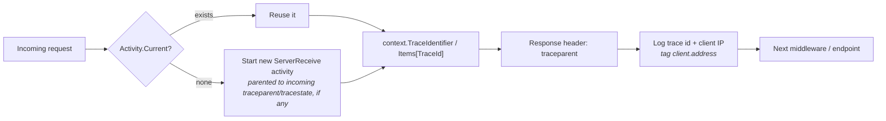

`ArturRios.Util.WebApi` ships two request-pipeline middlewares — `TraceActivityMiddleware` and
`ExceptionMiddleware` — plus `TracePropagationHandler`, a `DelegatingHandler` that carries the same
trace id onto outgoing `HttpClient` calls. (The third pipeline middleware, `AuthenticationMiddleware`, is
covered on the [Security](../security/) page.) `WebApiStartup` adds all of them for you through
`UseStandardMiddlewares()`, as referenced in [Architecture](../architecture/) and
[Configuration](../configuration/).

## `WebApiMiddleware` and registration order

`UseStandardMiddlewares()` (`ArturRios.Util.WebApi.Configuration`) adds the built-in middlewares in a
fixed order:

```csharp
app.UseStandardMiddlewares();
// 0. UseForwardedHeaders      — no-op until ForwardedHeadersOptions is configured
// 1. TraceActivityMiddleware  — assigns/propagates a W3C trace id
// 2. ExceptionMiddleware      — turns unhandled exceptions into a JSON error envelope
// 3. Swagger JSON + UI        — only when the Swagger generator was registered
// 4. UseCors(policy)          — only when a CORS policy name is passed
// 5. AuthenticationMiddleware — only when AddTokenAuthentication was registered
```

`TraceActivityMiddleware` runs first so the trace id is available to everything downstream, including
exception logging; `ExceptionMiddleware` runs next so it can catch exceptions thrown by authentication or
the endpoint itself; Swagger and CORS come before `AuthenticationMiddleware` (see [Security](../security/)),
which runs last, so the Swagger UI and CORS preflight requests never need a token.
`WebApiStartup` calls it as the first step of the pipeline; on a plain `WebApplication`, call it yourself.

`WebApiMiddleware` is an abstract marker base class with no members. Its only job is letting
`UseWebApiMiddlewares(params IEnumerable<Type>)` recognize which types it's safe to register with
`app.UseMiddleware(...)` — any type that isn't a subclass of `WebApiMiddleware` throws an
`ArgumentException`, and nothing is registered. Registration happens **in the order given**. Derive your
own middlewares from it and list them in `WebApiStartupOptions.Middlewares`, which `WebApiStartup` passes to
`UseWebApiMiddlewares` right after the standard middlewares and before the endpoints:

```csharp
public class Startup(string[] args) : WebApiStartup(args, options =>
{
    options.Middlewares.Add(typeof(RequestTimingMiddleware));
    options.Middlewares.Add(typeof(TenantMiddleware));
})
{
    // ...
}

// or, on a plain WebApplication:
app.UseStandardMiddlewares();
app.UseWebApiMiddlewares(typeof(RequestTimingMiddleware), typeof(TenantMiddleware));
```

Don't list the built-in middlewares there as well — they would run twice.

## `ExceptionMiddleware`

`ExceptionMiddleware.InvokeAsync` wraps the rest of the pipeline in a try/catch:

- **Client-initiated cancellations** — an `OperationCanceledException` or `TaskCanceledException` caught
  while `httpContext.RequestAborted.IsCancellationRequested` is true is logged at **Debug** level
  (`"Request was canceled by the client..."`) and swallowed. No response is written, since there's no
  client left to receive one.
- **`EndpointDisabledException`** (thrown by [`[EndpointToggle]`](../endpoint-toggle/) with the
  `Exception` output type) is logged at **Information** level and answered with the exception's own
  `StatusCode` — the toggle's `disabledStatusCode` — rather than 500, with its messages in the envelope's
  `Errors`.
- **`BadHttpRequestException`** — a client fault detected by Kestrel or a binder, such as a request body over
  `MaxRequestBodySize` (413) or a malformed body (400) — is logged at **Information** level and answered with the
  exception's own `StatusCode`, with that status's reason phrase (e.g. `"Payload Too Large"`) in `Errors`. This
  is the status Kestrel itself would have answered with, so a bad request is never reported as a server error.
- **Everything else** falls through to a single structured `logger.LogError(exception, "Unhandled
  exception while processing the request.")` call, followed by an HTTP 500 response — unless the request
  was aborted, in which case it logs at Debug and returns without writing anything.
- **Response already started** — if the response has already begun streaming when the exception
  surfaces, the exception is **rethrown** rather than handled, so the server aborts the response instead
  of leaving the client with a truncated body that looks complete.

The 500 response body is a JSON `DataOutput<string>` envelope. By default its `Errors` carry a single
**generic** message — `"Internal server error, please try again later"` — so internal exception details
are never leaked to the client. The one exception: if the thrown exception is a `CustomException`, its
own `Messages` are returned in `Errors` instead, letting application code surface a deliberate,
safe-to-show error through the same envelope shape `ToActionResult` uses everywhere else (see
[Responses](../responses/)).

The response body is serialized with ASP.NET Core's configured JSON options (camelCase by default), so it
has the same shape as the envelopes MVC writes for controller results — the same applies to the 401
envelopes `AuthenticationMiddleware` writes. A generic 500 looks like:

```json
{
  "data": "",
  "success": false,
  "errors": ["Internal server error, please try again later"],
  "messages": [],
  "timestamp": "2026-01-01T12:00:00Z"
}
```

## `TraceActivityMiddleware`

`TraceActivityMiddleware` ensures every request is associated with a W3C-format `Activity`. The W3C
`Activity.DefaultIdFormat`/`Activity.ForceDefaultIdFormat` configuration is set **once**, in a static
constructor — not on every request.

For each request, `InvokeAsync`:

1. Reuses `Activity.Current` if one already exists, or starts a new `"ServerReceive"` activity otherwise.
   When it starts one and the request carries a valid `traceparent` (and optionally `tracestate`)
   header, the new activity is parented to it, so the caller's trace continues instead of a new,
   unrelated trace being started.
2. Sets `context.TraceIdentifier` and `context.Items["TraceId"]` to the activity's trace id.
3. Writes a `traceparent` response header formatted as `00-{traceId}-{spanId}-{flags}` (the standard W3C
   trace-context format), so callers can correlate their request with the server-side trace even if they
   didn't originate it.
4. Logs `Started request with TraceId {TraceId} from {ClientIp}` at `Information`, and tags the activity
   with `client.address` (the OpenTelemetry convention), so tracing backends show who made the request.

### The client IP address

The address comes from `HttpContext.GetClientIpAddress()` (`ArturRios.Util.WebApi.Extensions`), which you
can call from your own code too. It reads `Connection.RemoteIpAddress`, returns an IPv4 address carried as
IPv6 (`::ffff:203.0.113.7`) in its IPv4 form, and returns `null` when the server doesn't know the address
(logged as `unknown`).

Behind a reverse proxy or load balancer, `RemoteIpAddress` is the proxy's address. `UseStandardMiddlewares()`
(and so `WebApiStartup`) runs ASP.NET Core's `UseForwardedHeaders()` as its very first step, ahead of
`TraceActivityMiddleware`. It does nothing until you configure `ForwardedHeadersOptions` with the headers to
honor and the proxies you trust; then the real client address is taken from `X-Forwarded-For`. Neither the
middleware nor `GetClientIpAddress` reads that header directly, since any client can forge it:

```csharp
// In ConfigureServices (or on a plain builder):
builder.Services.Configure<ForwardedHeadersOptions>(options =>
{
    options.ForwardedHeaders = ForwardedHeaders.XForwardedFor | ForwardedHeaders.XForwardedProto;
    options.KnownProxies.Add(IPAddress.Parse("10.0.0.10"));
});
```

An IP address is personal data in many jurisdictions (for example under the GDPR); keep it in mind when
deciding where these logs are shipped and how long they are kept.

### Turning the client IP off

Both uses of the address are controlled by `TraceActivityOptions` (`ArturRios.Util.WebApi.Middleware`), and
both default to `true`:

| Option | Default | Effect |
|---|---|---|
| `LogClientIp` | `true` | Includes the address in the start log. When `false`, the entry is `Started request with TraceId {TraceId}`, with no `ClientIp` property at all. |
| `TagClientAddress` | `true` | Tags the address on the activity as `client.address`. |

With `WebApiStartup`, set them on the startup options:

```csharp
public class Startup(string[] args) : WebApiStartup(args, options =>
{
    options.TraceActivity.LogClientIp = false;
    options.TraceActivity.TagClientAddress = false;
})
{
    // ...
}
```

The middleware reads them from `IOptions<TraceActivityOptions>`, so on a plain builder — or to drive them from
configuration — register them like any other options. A `Configure` call made in `ConfigureServices` runs after
the startup options are applied, so it wins:

```csharp
builder.Services.Configure<TraceActivityOptions>(builder.Configuration.GetSection("TraceActivity"));
```

```json
{ "TraceActivity": { "LogClientIp": false, "TagClientAddress": false } }
```



## `TracePropagationHandler`

`TracePropagationHandler` is a `DelegatingHandler` for outgoing typed/named `HttpClient`s. When
`Activity.Current` is set (typically because `TraceActivityMiddleware` is running the current request)
and the outgoing request doesn't already carry a `traceparent` header, it adds one built from the same
`00-{traceId}-{spanId}-{flags}` format, plus a `tracestate` header when the activity has one — so a call
your service makes to another service continues the same distributed trace instead of starting a new one.

Add it to any typed or named `HttpClient` you want the trace id to flow through with the
`AddTracePropagation()` extension (`HttpClientBuilderExtensions`, in `ArturRios.Util.WebApi.Extensions`), which also registers the handler
with the container:

```csharp
builder.Services.AddHttpClient<MyApiClient>()
    .AddTracePropagation();
```

See [HTTP Client](../http-client/) for how `BaseWebApiClient` fits into that registration.

## Where to next

- **[Architecture](../architecture/)** — how these middlewares sit relative to `AuthenticationMiddleware` and
  `ToActionResult` in the full pipeline.
- **[Configuration](../configuration/)** — the standard `WebApiStartup` sequence, and registering extra
  middlewares through `WebApiStartupOptions.Middlewares`.
- **[HTTP Client](../http-client/)** — pairing `TracePropagationHandler` with `BaseWebApiClient`.
- **[Responses](../responses/)** — the `DataOutput<T>`/`ProcessOutput` envelopes `ExceptionMiddleware` and
  `ToActionResult` both use.
