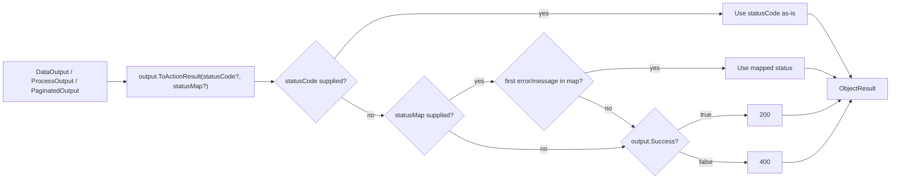

`ToActionResult` is an extension method (in `OutputActionResultExtensions`, namespace
`ArturRios.Util.WebApi.AspNetCore`) that converts `ArturRios.Output` envelopes — `DataOutput<T>`,
`ProcessOutput`, and `PaginatedOutput<T>` — into ASP.NET Core `ActionResult`s, so a controller action
never has to hand-pick a status code for the happy and unhappy paths itself.

`ToActionResult` replaces the static `ResponseResolver.Resolve(output, ...)`, which was removed in 5.0.0
with no change in behavior: replace each `ResponseResolver.Resolve(output, ...)` call with
`output.ToActionResult(...)`.

## `ToActionResult` overloads

`ToActionResult` has three overloads, one per envelope type:

| Overload | Returns |
|---|---|
| `ToActionResult<T>(this DataOutput<T?> dataOutput, int? statusCode = null, statusMap = null)` | `ActionResult<DataOutput<T?>>` |
| `ToActionResult(this ProcessOutput processOutput, int? statusCode = null, statusMap = null)` | `ActionResult<ProcessOutput>` |
| `ToActionResult<T>(this PaginatedOutput<T> paginatedOutput, int? statusCode = null, statusMap = null)` | `ActionResult<PaginatedOutput<T>>` |

Each wraps the envelope in an `ObjectResult` whose `StatusCode` is set from the resolved status code —
none of the three re-shape or otherwise touch the envelope itself; the body returned to the client is the
same object you passed in.

## Status resolution order

Every overload also accepts an optional `statusMap` — an
`IReadOnlyDictionary<string, int>` from an envelope message to an HTTP status code — and
resolves its status the same way:

1. **`statusCode` supplied** — used as-is, regardless of the envelope's `Success` value or
   the map.
2. **`statusMap` supplied** — the lookup key is the **first `Errors` entry** when `Success`
   is `false`, or the **first `Messages` entry** when `Success` is `true`. If that key is
   present in the map, its value is used.
3. **Otherwise** — no map, an empty list, or a key not found — defaults to **200** when
   `Success` is `true` and **400** otherwise.

The caller owns the dictionary, so its key comparer controls matching — build it with
`StringComparer.OrdinalIgnoreCase` for case-insensitive keys.

The same resolution is exposed on its own as `output.ResolveStatusCode(statusCode?, statusMap?)`, which
returns the `int` status without building an `ActionResult` — useful when the envelope is written some
other way.



To map specific errors to specific statuses without branching in the action, pass a
`statusMap` keyed on the envelope's first error:

```csharp
var statusMap = new Dictionary<string, int>
{
    ["User not found"] = 404,
    ["Email already registered"] = 409,
};

return output.ToActionResult(statusMap: statusMap);
```

This means a failed operation that should still return, say, a 404 or 409 rather than a generic 400 just
needs an explicit `statusCode`:

```csharp
return output.ToActionResult(statusCode: 404);
```

## Pairing with the envelopes

`ToActionResult` is the last stop for the "envelopes, not exceptions" pattern the rest of the library
follows (see [Architecture](../architecture/)): application code builds a `ProcessOutput` or
`DataOutput<T>` (`WithData`, `WithError`, etc.) to describe what happened, and `ToActionResult` is the
single place that decides how that maps onto the HTTP response — so success and failure both flow through
the same, predictable shape instead of being scattered across `Ok(...)`/`BadRequest(...)`/`NotFound(...)`
calls in every action. It pairs naturally with `AddCustomInvalidModelStateResponse()` (see
[Configuration](../configuration/)), which shapes ASP.NET Core's own model-validation 400 as a
`DataOutput<string>` so it looks identical to a failure returned through `ToActionResult`.

## Controller-action example

```csharp
[HttpGet("{id:int}")]
public ActionResult<DataOutput<UserDto?>> GetById(int id)
{
    DataOutput<UserDto?> output = _userService.GetById(id);

    return output.ToActionResult();
}
```

`_userService.GetById` returns a `DataOutput<UserDto?>` whose `Success` reflects whether the user was
found; `ToActionResult` turns that straight into a 200 with the user payload or a 400 with the
service's error messages, with no branching in the action itself.

## Where to next

- **[Architecture](../architecture/)** — where `ToActionResult` sits at the end of the request pipeline,
  and the envelope class hierarchy (`ProcessOutput` → `DataOutput<T>` → `PaginatedOutput<T>`).
- **[Configuration](../configuration/)** — `AddCustomInvalidModelStateResponse()`, which shapes validation
  failures the same way.
- **[Middleware & Diagnostics](../middleware-and-diagnostics/)** — `ExceptionMiddleware`, which returns the
  same `DataOutput<string>` shape for unhandled exceptions that never reach a `ToActionResult` call.
