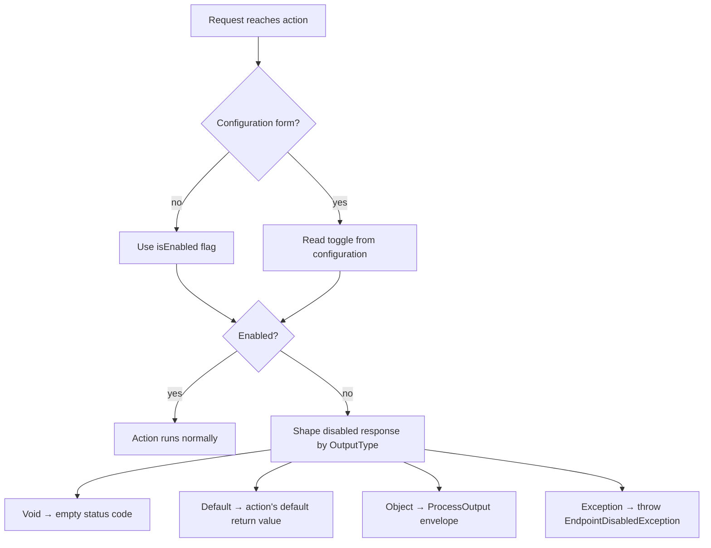

+++
title = 'Endpoint Toggling'
+++

# Endpoint Toggling

`[EndpointToggle]` is an action filter attribute that turns a single endpoint on or off. When the endpoint
is disabled, the request is short-circuited **before the action runs** and a response is returned in one of
several shapes. The toggle can be fixed in code or resolved from configuration on every request, so an
endpoint can be disabled without a redeploy.

## The two forms

The attribute has two constructors — pick one per endpoint:

| Form | Constructor | Toggle source |
|---|---|---|
| Compile-time | `[EndpointToggle(bool isEnabled = true, ...)]` | The `isEnabled` flag, fixed at build time. |
| Configuration | `[EndpointToggle(ConfigurationSourceType configurationSource, ...)]` | A configuration value re-read on every request. |

```csharp
public class ReportsController : ControllerBase
{
    // Compile-time: always disabled until the code changes.
    [EndpointToggle(isEnabled: false)]
    [HttpGet("legacy")]
    public IActionResult Legacy() { /* ... */ }

    // Configuration: re-read from "Endpoints:Reports:Export" on every request.
    [EndpointToggle(ConfigurationSourceType.AppSettings)]
    [HttpGet("export")]
    public IActionResult Export() { /* ... */ }
}
```

## Request flow



## Resolving the toggle from configuration

The configuration form reads its value from the source given by `ConfigurationSourceType`:

| `ConfigurationSourceType` | Read from | Key separator |
|---|---|---|
| `AppSettings` | `IConfiguration` (resolved from the request's services) | `:` |
| `EnvFile` / `EnvironmentVariables` | Process environment variables (`Environment.GetEnvironmentVariable`) | `_` |

### The key

Pass an explicit `key` to read a specific configuration entry. When `key` is empty, the key is **derived**
from the key prefix, the current controller name, the action name, and the optional suffix:

```
<keyPrefix with [Controller] replaced><sep><ActionName>[<sep><keySuffix>]
```

When `keyPrefix` is empty, a default is used — `Endpoints:[Controller]` for app settings, or
`Endpoints_[Controller]` for environment variables — with `[Controller]` replaced by the current
controller name. So `[EndpointToggle(ConfigurationSourceType.AppSettings)]` on `Export` in
`ReportsController` reads `Endpoints:Reports:Export`, while the environment-variable form reads
`Endpoints_Reports_Export`.

### Missing values default to *enabled*

If the toggle can't be resolved to an explicit boolean, the endpoint stays **enabled**, so a misconfigured
toggle never silently hides a working endpoint. Both sources behave the same way: only a value that parses
as `false` disables the endpoint; an absent, empty, or non-boolean value leaves it enabled.

| Situation | Result |
|---|---|
| Key set to `true` | Enabled |
| Key set to `false` | Disabled |
| Key absent, empty, or non-boolean | Enabled (fallback) |
| App-settings `IConfiguration` not registered | Enabled (fallback) |

## Shaping the disabled response

When an endpoint is disabled, `disabledOutputType` (an `OutputType`) decides what the caller receives:

| `OutputType` | Disabled response | Status code |
|---|---|---|
| `Void` | Empty result, no body. | `disabledStatusCode` (default `404`) |
| `Default` | The action's default return value — `default(T)` for value types, `null` for reference types, or an empty result for `void`. | `disabledStatusCode` (default `404`) |
| `Object` *(default)* | A `ProcessOutput` envelope carrying `disabledMessage`. | `disabledStatusCode` (default `404`) |
| `Exception` | Throws `EndpointDisabledException`, handled by the exception pipeline (e.g. [`ExceptionMiddleware`](/middleware-and-diagnostics/)). | Decided by the exception handler |

A few details worth knowing:

- `disabledStatusCode` defaults to `404 Not Found` and is honored by the `Void`, `Default` and `Object`
  shapes whenever the caller provides it.
- `disabledMessage` (default `"This endpoint is currently disabled"`) is only included by the `Object`
  shape. The `Exception` shape always carries the default message.
- `EndpointToggleAttribute.DefaultDisabledStatusCode` and `DefaultDisabledMessage` expose those defaults.

```csharp
// Disabled requests get a 503 with a ProcessOutput explaining why.
[EndpointToggle(
    ConfigurationSourceType.AppSettings,
    disabledStatusCode: HttpStatusCode.ServiceUnavailable,
    disabledOutputType: OutputType.Object,
    disabledMessage: "Reporting is paused for maintenance")]
[HttpGet("export")]
public IActionResult Export() { /* ... */ }
```

## Where to next

- **[Configuration](/dotnet-webapi-util/configuration)** — how `appsettings.json` and environment values are loaded into
  the host that `[EndpointToggle]` reads from.
- **[Middleware & Diagnostics](/dotnet-webapi-util/middleware-and-diagnostics)** — `ExceptionMiddleware`, which handles the
  `EndpointDisabledException` thrown by the `Exception` output type.
- **[Responses](/dotnet-webapi-util/responses)** — the `ProcessOutput` envelope used by the `Object` output type.
