+++
title = 'HTTP Client'
+++

# HTTP Client

`ArturRios.Util.WebApi` gives you a thin base for typed clients that call another web API:
`BaseWebApiClient` owns a shared `HttpGateway`, and `BaseWebApiClientRoute` groups related endpoints
under a base URL with helpers for authenticating and carrying the resulting bearer token.

## `BaseWebApiClient`

`BaseWebApiClient` is abstract and exposes a protected `HttpGateway Gateway` that every route object uses
to issue requests. It has two constructors:

- **`BaseWebApiClient(HttpClient httpClient)`** — wraps an existing `HttpClient`. **Prefer this one**: it
  lets the client be created through `IHttpClientFactory` (via `AddHttpClient<T>()`), which manages the
  underlying `HttpClient`'s lifetime and connection pooling for you and is what lets you attach message
  handlers like `TracePropagationHandler`.
- **`BaseWebApiClient(string baseUrl)`** — constructs its own `HttpClient` with `BaseAddress = baseUrl`.
  Simpler for quick/manual use, but you lose `IHttpClientFactory`'s pooling and the ability to attach
  handlers through DI.

Both constructors call the abstract `SetRoutes()` method before returning, so a derived class implements
it to instantiate its route objects against the shared `Gateway`:

```csharp
public class MyApiClient : BaseWebApiClient
{
    public AccountsRoute Accounts { get; private set; } = null!;

    public MyApiClient(HttpClient httpClient) : base(httpClient) { }

    protected override void SetRoutes()
    {
        Accounts = new AccountsRoute(Gateway);
    }
}
```

## `BaseWebApiClientRoute`

`BaseWebApiClientRoute(HttpGateway gateway)` is the base for a group of related routes on the remote API.
It exposes:

- **`abstract string BaseUrl`** — the base path this route group is mounted under (e.g. `/accounts`).
- **`AuthenticateAsync(Credentials credentials, string authRoute)`** — posts `credentials` to `authRoute`
  via the shared `Gateway` and returns the resulting `Authentication`. Throws `WebApiClientException` if
  the response comes back with no body.
- **`Authorize(string authToken)`** — sets `Gateway.Client.DefaultRequestHeaders.Authorization` to a
  `Bearer` header carrying `authToken`. This is a plain **assignment**, so it's **idempotent** — calling
  it again (e.g. after re-authenticating) simply replaces the previous header rather than accumulating
  anything.
- **`AuthenticateAndAuthorizeAsync(Credentials credentials, string authRoute)`** — calls
  `AuthenticateAsync` then `Authorize` with the returned token, in one call.

```csharp
public class AccountsRoute(HttpGateway gateway) : BaseWebApiClientRoute(gateway)
{
    public override string BaseUrl => "/accounts";

    public Task LoginAsync(Credentials credentials) =>
        AuthenticateAndAuthorizeAsync(credentials, $"{BaseUrl}/login");
}
```

After `LoginAsync` completes, every subsequent call made through the shared `Gateway` — from `Accounts`
or any other route object on the same client — carries the `Authorization: Bearer` header, since they all
share the same underlying `HttpClient`.

## `WebApiClientException`

A plain `Exception` subclass raised when a `BaseWebApiClientRoute` operation can't complete — currently,
only when `AuthenticateAsync` gets a response with no body. Catch it around login calls if you want to
distinguish "the remote API is unreachable/malformed" from a normal authentication failure surfaced
through the `Authentication.Valid` flag.

## Pairing with `TracePropagationHandler`

Because the `HttpClient`-based constructor is built for `IHttpClientFactory`, you can attach
`TracePropagationHandler` (see [Middleware & Diagnostics](/middleware-and-diagnostics/)) so every
outgoing call from the client carries the current request's W3C trace id:

```csharp
builder.Services.AddTransient<TracePropagationHandler>();
builder.Services.AddHttpClient<MyApiClient>()
    .AddHttpMessageHandler<TracePropagationHandler>();
```



```mermaid
flowchart LR
    Ctor["MyApiClient(HttpClient)"] --> SetRoutes["SetRoutes()"]
    SetRoutes --> Accounts["AccountsRoute(Gateway)"]
    Accounts -- "AuthenticateAndAuthorizeAsync" --> Login["POST /accounts/login"]
    Login -- "Authentication.Token" --> Authorize["Authorize(token)"]
    Authorize --> Header["Gateway.Client default Authorization header"]
    Header --> Calls["Subsequent calls via Gateway"]
    Calls -- "TracePropagationHandler" --> Downstream["Downstream API"]
```

## Where to next

- **[Middleware & Diagnostics](/middleware-and-diagnostics/)** — `TracePropagationHandler` and the trace
  id it propagates.
- **[Security](/security/)** — `Credentials`, `Authentication` and the login flow this client typically
  calls into.
- **[Responses](/responses/)** — the `ArturRios.Output` envelopes returned by the APIs these clients call.
