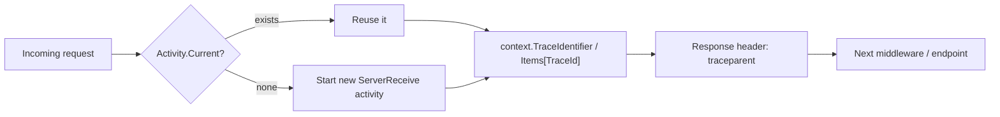

+++
title = 'Middleware & Diagnostics'
+++

# Middleware & Diagnostics

`ArturRios.Util.WebApi` ships two request-pipeline middlewares — `TraceActivityMiddleware` and
`ExceptionMiddleware` — plus `TracePropagationHandler`, a `DelegatingHandler` that carries the same
trace id onto outgoing `HttpClient` calls. (The third pipeline middleware, `JwtMiddleware`, is covered
on the [Security](/security/) page.) The middlewares are registered through `AddMiddlewares`, as
referenced in [Architecture](/architecture/) and [Configuration](/configuration/).

## `WebApiMiddleware` and registration order

`WebApiMiddleware` is an abstract marker base class with no members. Its only job is letting
`WebApiStartup.AddMiddlewares(Type[])` recognize which types it's safe to register with
`App.UseMiddleware(...)` — any type in the array that isn't a subclass of `WebApiMiddleware` is silently
skipped. Registration happens **in the order given**:

```csharp
AddMiddlewares([
    typeof(TraceActivityMiddleware), // assigns/propagates a W3C trace id
    typeof(ExceptionMiddleware),     // turns unhandled exceptions into a JSON error envelope
    typeof(JwtMiddleware)
]);
```

`TraceActivityMiddleware` runs first so the trace id is available to everything downstream, including
exception logging; `ExceptionMiddleware` runs next so it can catch exceptions thrown by authentication or
the endpoint itself; `JwtMiddleware` (see [Security](/security/)) runs last of the three.

## `ExceptionMiddleware`

`ExceptionMiddleware.InvokeAsync` wraps the rest of the pipeline in a try/catch:

- **Client-initiated cancellations** — an `OperationCanceledException` or `TaskCanceledException` caught
  while `httpContext.RequestAborted.IsCancellationRequested` is true is logged at **Debug** level
  (`"Request was canceled by the client..."`) and swallowed. No response is written, since there's no
  client left to receive one.
- **Everything else** falls through to a single structured `logger.LogError(exception, "Unhandled
  exception while processing the request.")` call, followed by an HTTP 500 response — unless the response
  has already started or the request was aborted, in which case it logs at Debug and returns without
  writing anything.

The 500 response body is a JSON `DataOutput<string>` envelope. By default its `Messages` carry a single
**generic** message — `"Internal server error, please try again later"` — so internal exception details
are never leaked to the client. The one exception: if the thrown exception is a `CustomException`, its
own `Messages` are returned instead, letting application code surface a deliberate, safe-to-show error
through the same envelope shape `ResponseResolver` uses everywhere else (see [Responses](/responses/)).

The response body is serialized with `JsonConvert.SerializeObject(output)` (Newtonsoft, default casing),
so a generic 500 looks like:

```json
{
  "Success": false,
  "Data": "",
  "Messages": ["Internal server error, please try again later"],
  "Errors": []
}
```

## `TraceActivityMiddleware`

`TraceActivityMiddleware` ensures every request is associated with a W3C-format `Activity`. The W3C
`Activity.DefaultIdFormat`/`Activity.ForceDefaultIdFormat` configuration is set **once**, in a static
constructor — not on every request.

For each request, `InvokeAsync`:

1. Reuses `Activity.Current` if one already exists, or starts a new `"ServerReceive"` activity otherwise.
2. Sets `context.TraceIdentifier` and `context.Items["TraceId"]` to the activity's trace id.
3. Writes a `traceparent` response header formatted as `00-{traceId}-{spanId}-{flags}` (the standard W3C
   trace-context format), so callers can correlate their request with the server-side trace even if they
   didn't originate it.



## `TracePropagationHandler`

`TracePropagationHandler` is a `DelegatingHandler` for outgoing typed/named `HttpClient`s. When
`Activity.Current` is set (typically because `TraceActivityMiddleware` is running the current request)
and the outgoing request doesn't already carry a `traceparent` header, it adds one built from the same
`00-{traceId}-{spanId}-{flags}` format — so a call your service makes to another service continues the
same distributed trace instead of starting a new one.

Register it as a message handler on any typed `HttpClient` you want the trace id to flow through:

```csharp
builder.Services.AddTransient<TracePropagationHandler>();
builder.Services.AddHttpClient<MyApiClient>()
    .AddHttpMessageHandler<TracePropagationHandler>();
```

See [HTTP Client](/http-client/) for how `BaseWebApiClient` fits into that registration.

## Where to next

- **[Architecture](/architecture/)** — how these middlewares sit relative to `JwtMiddleware` and
  `ResponseResolver` in the full pipeline.
- **[Configuration](/configuration/)** — registering middlewares via `AddMiddlewares` as part of
  `WebApiStartup`.
- **[HTTP Client](/http-client/)** — pairing `TracePropagationHandler` with `BaseWebApiClient`.
- **[Responses](/responses/)** — the `DataOutput<T>`/`ProcessOutput` envelopes `ExceptionMiddleware` and
  `ResponseResolver` both use.
