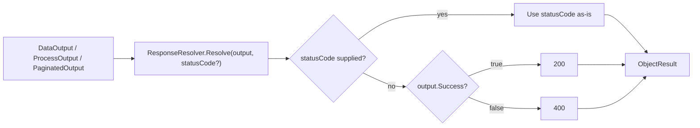

+++
title = 'Responses'
+++

# Responses

`ResponseResolver` is a static class that converts `ArturRios.Output` envelopes — `DataOutput<T>`,
`ProcessOutput`, and `PaginatedOutput<T>` — into ASP.NET Core `ActionResult`s, so a controller action
never has to hand-pick a status code for the happy and unhappy paths itself.

## `Resolve` overloads

`ResponseResolver.Resolve` has three overloads, one per envelope type:

| Overload | Returns |
|---|---|
| `Resolve<T>(DataOutput<T?> dataOutput, int? statusCode = null)` | `ActionResult<DataOutput<T?>>` |
| `Resolve(ProcessOutput processOutput, int? statusCode = null)` | `ActionResult<ProcessOutput>` |
| `Resolve<T>(PaginatedOutput<T> paginatedOutput, int? statusCode = null)` | `ActionResult<PaginatedOutput<T>>` |

Each wraps the envelope in an `ObjectResult` whose `StatusCode` is set from the resolved status code —
none of the three re-shape or otherwise touch the envelope itself; the body returned to the client is the
same object you passed in.

## Default status mapping

Every overload resolves its HTTP status the same way:

- **`statusCode` supplied** — used as-is, regardless of the envelope's `Success` value.
- **`statusCode` omitted** — defaults to **200** when the envelope's `Success` is `true`, and **400**
  otherwise.



This means a failed operation that should still return, say, a 404 or 409 rather than a generic 400 just
needs an explicit `statusCode`:

```csharp
return ResponseResolver.Resolve(output, statusCode: 404);
```

## Pairing with the envelopes

`ResponseResolver` is the last stop for the "envelopes, not exceptions" pattern the rest of the library
follows (see [Architecture](/architecture/)): application code builds a `ProcessOutput` or
`DataOutput<T>` (`WithData`, `WithError`, etc.) to describe what happened, and `ResponseResolver` is the
single place that decides how that maps onto the HTTP response — so success and failure both flow through
the same, predictable shape instead of being scattered across `Ok(...)`/`BadRequest(...)`/`NotFound(...)`
calls in every action. It pairs naturally with `AddCustomInvalidModelStateResponse()` (see
[Configuration](/configuration/)), which shapes ASP.NET Core's own model-validation 400 as a
`DataOutput<string>` so it looks identical to a `Resolve`d failure.

## Controller-action example

```csharp
[HttpGet("{id:int}")]
public ActionResult<DataOutput<UserDto?>> GetById(int id)
{
    DataOutput<UserDto?> output = _userService.GetById(id);

    return ResponseResolver.Resolve(output);
}
```

`_userService.GetById` returns a `DataOutput<UserDto?>` whose `Success` reflects whether the user was
found; `ResponseResolver.Resolve` turns that straight into a 200 with the user payload or a 400 with the
service's error messages, with no branching in the action itself.

## Where to next

- **[Architecture](/architecture/)** — where `ResponseResolver` sits at the end of the request pipeline,
  and the envelope class hierarchy (`ProcessOutput` → `DataOutput<T>` → `PaginatedOutput<T>`).
- **[Configuration](/configuration/)** — `AddCustomInvalidModelStateResponse()`, which shapes validation
  failures the same way.
- **[Middleware & Diagnostics](/middleware-and-diagnostics/)** — `ExceptionMiddleware`, which returns the
  same `DataOutput<string>` shape for unhandled exceptions that never reach a `Resolve` call.
