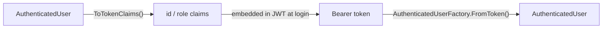

+++
title = 'Security'
+++

# Security

`ArturRios.Util.WebApi` ships token authentication and role-based authorization as a small, composable
set of pieces: `AuthenticationMiddleware` extracts and validates the token and attaches the user, a pair
of attributes/filters declare access rules, and `Credentials`/`Authentication` give you the record types
for a login flow.

Two token schemes are supported side by side — the app's own HMAC JWT and Google ID tokens — and either
can be accepted on a given request. Which scheme(s) are enabled, where the token is read from, and how the
user is resolved are all controlled by one `AuthenticationOptions` instance, registered via
`AddTokenAuthentication`.

## Registering authentication — `AddTokenAuthentication`

```csharp
builder.Services.AddTokenAuthentication(options =>
{
    options.Source = TokenSource.Either;  // Header | Cookie | Either — default: Header
    options.CookieName = "access_token";  // default
    options.EnableJwt = true;             // default
    options.EnableGoogle = true;          // default: false
    options.GoogleClientIds = ["your-google-oauth-client-id"];
    options.JwtMode = JwtValidationMode.ClaimsOnly; // or Revalidate — default: ClaimsOnly
});
```

`AddTokenAuthentication` registers the `AuthenticationOptions` instance plus one `ITokenValidator` per
enabled scheme (app JWT first, then Google, so that's the order `AuthenticationMiddleware` tries them
in). It throws an `ArgumentException` if:

- neither `EnableJwt` nor `EnableGoogle` is `true` — at least one scheme must be enabled; or
- `EnableGoogle` is `true` but `GoogleClientIds` is empty.

The app must still separately register `JwtConfiguration`/`JwtHandler` (for the JWT scheme) and, when
required (see below), an `IAuthenticationProvider`.

## `TokenSource` — where the token is read from

`AuthenticationOptions.Source` controls how `AuthenticationMiddleware` extracts the raw token from the
request, via `TokenExtractor`:

- **`Header` (default)** — the `Authorization` header only. The scheme **must** be `Bearer`
  (case-insensitive) with a non-empty parameter; any other or malformed scheme is treated as no token.
- **`Cookie`** — the cookie named `CookieName` (default `"access_token"`) only.
- **`Either`** — the header first, falling back to the cookie if the header carries no token.

## `AuthenticationMiddleware`

`AuthenticationMiddleware` runs once per request (see [Architecture](/architecture/) for where it sits in
the pipeline). For each request it:

1. Skips validation entirely for Swagger routes and for endpoints marked `[AllowAnonymous]`.
2. Extracts the token per `AuthenticationOptions.Source`, as above.
3. Runs the token through the enabled validators, in registration order (app JWT, then Google). The first
   validator that resolves an `AuthenticatedUser` wins: it's attached to `HttpContext.Items["User"]` and
   the next middleware runs.
4. If no validator resolves a user, the request gets a 401 with the last validator's error (e.g.
   `"Invalid token"`, `"Invalid Google token"`, `"User not found"`).

## The app JWT scheme — `ClaimsOnly` vs `Revalidate`

When `EnableJwt` is `true`, `JwtTokenValidator` first checks the token's signature via
`JwtHandler.IsTokenValidAsync`; an invalid or missing token fails with `"Invalid token"`. How the user is
then resolved is controlled by `AuthenticationOptions.JwtMode`:

- **`ClaimsOnly` (default)** — `AuthenticatedUserFactory.FromToken` rebuilds the user from the token's
  `id` and `role` claims. No data store is queried, so authentication costs nothing beyond the signature
  check. The trade-off: because nothing is re-checked server-side, role changes and revocations only take
  effect once the token expires. Keep access-token lifetimes short and pair this mode with refresh
  tokens.
- **`Revalidate`** — the user id is read from the token, and `IAuthenticationProvider` is resolved
  **per-request** from `HttpContext.RequestServices` (so it can be a scoped service) and its
  `GetAuthenticatedUserById` is called. This guarantees freshness — a deleted or role-changed user is
  rejected or updated on the very next request — at the cost of one lookup per request. An
  `IAuthenticationProvider` **must** be registered for this mode.

## Google authentication

When `EnableGoogle` is `true`, `GoogleTokenValidator` verifies the token via `IGoogleTokenVerifier` — by
default `GoogleTokenVerifier`, backed by `Google.Apis.Auth`'s `GoogleJsonWebSignature`, which checks
signature, issuer, expiry and audience against `GoogleClientIds`. On success, the token's verified email
is looked up through `IAuthenticationProvider.GetAuthenticatedUserByEmail`. An `IAuthenticationProvider`
is therefore **required** whenever `EnableGoogle` is `true` — the same requirement as JWT `Revalidate`
mode, above.

To accept Google sign-in:

1. Add the `Google.Apis.Auth` package (already a dependency of this library, so it resolves transitively
   — add it explicitly to your project only if you call its APIs directly).
2. Set `EnableGoogle = true` and `GoogleClientIds` to your app's accepted OAuth client ID(s)/audiences in
   the `AddTokenAuthentication` callback.
3. Implement `IAuthenticationProvider.GetAuthenticatedUserByEmail(string)` on your provider (alongside
   `GetAuthenticatedUserById` if you also use the JWT scheme) and register it, optionally wrapped with
   `AddCachedAuthenticationProvider<T>` (below).

`EnableJwt` and `EnableGoogle` are independent — enable both to let a single endpoint accept either an
app-issued JWT or a Google ID token on the same request path; `AuthenticationMiddleware` figures out which
one it got by trying each enabled validator in turn.

## Caching provider lookups

When using `Revalidate`, wrap your `IAuthenticationProvider` with `CachedAuthenticationProvider` so
repeated lookups of the same user within a short window are served from an `IMemoryCache` instead of
hitting the store on every request:

```csharp
builder.Services.AddCachedAuthenticationProvider<MyAuthenticationProvider>(options =>
{
    options.Ttl = TimeSpan.FromSeconds(30); // default: 60s
    options.CacheMisses = true;             // also cache "user not found" (default: false)
});
```

`AddCachedAuthenticationProvider<TProvider>` registers `TProvider` (your concrete `IAuthenticationProvider`
implementation) as a scoped service, adds `IMemoryCache`, and registers `IAuthenticationProvider` itself
as a `CachedAuthenticationProvider` decorating `TProvider`. Both provider methods are cached independently:
`GetAuthenticatedUserById` checks the cache first (key `"auth:user:" + id` by default, via
`CacheKeyPrefix`), and `GetAuthenticatedUserByEmail` does the same keyed by email (`"auth:email:" + email`
by default, via `EmailCacheKeyPrefix`). On a miss, each delegates to the inner provider and caches the
result for `Ttl`, but only caches a `null` result (a miss) when `CacheMisses` is `true`. This bounds
staleness to the TTL while collapsing bursts of requests for the same user into a single store hit —
`AuthenticationMiddleware` (for both the JWT `Revalidate` and Google schemes) and your own code both see
it as a plain `IAuthenticationProvider` and don't need to know caching is happening.

## Identity types

- **`AuthenticatedUser(int Id, int Role)`** — the record attached to `HttpContext.Items["User"]` after
  successful authentication, and returned by both `IAuthenticationProvider.GetAuthenticatedUserById` and
  `IAuthenticationProvider.GetAuthenticatedUserByEmail`.
- **`TokenClaimKeys`** — the claim key constants used on both ends of the token: `Id = "id"`,
  `Role = "role"`.
- **`AuthenticationExtensions.ToTokenClaims(this AuthenticatedUser)`** — converts an `AuthenticatedUser`
  into a `Dictionary<string, string>` keyed by `TokenClaimKeys`, ready to hand to your JWT-issuing code
  when you build the token at login time.
- **`AuthenticatedUserFactory.FromToken(string token)`** — reads a token's `id`/`role` claims (without
  validating its signature — callers must have already done that) and returns the reconstructed
  `AuthenticatedUser`, or `null` if the token can't be read or is missing a numeric `id` or `role` claim.
  This is what `JwtTokenValidator` calls in `ClaimsOnly` mode.



## Declaring access rules

```csharp
[Authorize]
[RoleRequirement(1, 2)] // e.g. Admin, Manager
public class AccountsController : ControllerBase
{
    [AllowAnonymous]
    [HttpPost("login")]
    public IActionResult Login(Credentials credentials) { /* ... */ }

    [HttpGet]
    public IActionResult GetAll() { /* only roles 1 and 2 reach here */ }
}
```

- **`[Authorize]`** — an `IAuthorizationFilter` that checks `HttpContext.Items["User"]`; if it's `null`,
  the request short-circuits with a 401 (`{"message": "Unauthorized"}`). It first checks the action for
  `[AllowAnonymous]` and returns immediately (no 401) if present.
- **`[RoleRequirement(params int[] authorizedRoles)]`** — a `TypeFilterAttribute` around
  `RoleRequirementFilter`. It reads the same `HttpContext.Items["User"]`; if the user is present and its
  `Role` is one of `authorizedRoles`, the request proceeds, otherwise it short-circuits with a 403
  (a `ProcessOutput` with the error `"You do not have permission to access this resource"`). It also
  honors `[AllowAnonymous]` — an anonymous-marked action returns immediately without a role check, even
  under `[RoleRequirement(...)]`.
- **`[AllowAnonymous]`** — a plain marker attribute; it doesn't enforce anything itself, but
  `AuthenticationMiddleware`, `AuthorizeAttribute` and `RoleRequirementFilter` all check for it and skip
  their own enforcement when it's present on the action.

Because both filters read `HttpContext.Items["User"]` rather than re-validating the token themselves,
`[Authorize]`/`[RoleRequirement]` only make sense downstream of `AuthenticationMiddleware` — see
[Architecture](/architecture/) for how the two fit together.

## `Credentials` and validation

```csharp
public record Credentials(string Email, string Password);
```

`CredentialsValidator` (FluentValidation) enforces:

- `Email` — not empty, and a valid email address format.
- `Password` — not empty, minimum length **8**.

```csharp
public class CredentialsValidator : AbstractValidator<Credentials>
{
    public CredentialsValidator()
    {
        RuleFor(credentials => credentials.Email).NotEmpty().EmailAddress();
        RuleFor(credentials => credentials.Password).NotEmpty().MinimumLength(8);
    }
}
```

## `Authentication` — the login result

```csharp
public record Authentication(string? Token, bool Valid, string CreatedAt, string Expiration);
```

The record your authentication route returns after checking `Credentials`: `Token` is the issued JWT (or
`null` on failure), `Valid` indicates whether the attempt succeeded, and `CreatedAt`/`Expiration` describe
the token's lifetime — the values you'd typically use to size access-token lifetime and drive a refresh
flow, especially under `ClaimsOnly` mode where a short expiration is what keeps role changes and
revocations bounded.

## Where to next

- **[Architecture](/dotnet-webapi-util/architecture)** — the full token → `AuthenticationMiddleware` →
  `Items["User"]` → authorization-filter flow, alongside the rest of the pipeline.
- **[Configuration](/dotnet-webapi-util/configuration)** — registering `AuthenticationMiddleware` via `AddMiddlewares`
  and wiring up `ConfigureSecurity()`.
- **[Middleware & Diagnostics](/dotnet-webapi-util/middleware-and-diagnostics)** — how `ExceptionMiddleware` and
  `TraceActivityMiddleware` relate to the rest of the pipeline `AuthenticationMiddleware` runs in.
