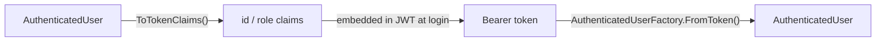

+++
title = 'Security'
+++

# Security

`ArturRios.Util.WebApi` ships JWT authentication and role-based authorization as a small, composable set
of pieces: `JwtMiddleware` validates the token and attaches the user, a pair of attributes/filters declare
access rules, and `Credentials`/`Authentication` give you the record types for a login flow.

## `JwtMiddleware`

`JwtMiddleware` runs once per request (see [Architecture](/architecture/) for where it sits in the
pipeline). For each request it:

1. Skips validation entirely for Swagger routes and for endpoints marked `[AllowAnonymous]`.
2. Extracts the bearer token from the `Authorization` header. The scheme **must** be `Bearer`
   (case-insensitive) with a non-empty parameter — any other or malformed scheme is treated as no token.
3. Validates the token's signature via `JwtHandler.IsTokenValidAsync`. An invalid or missing token
   produces a 401 with an `"Invalid token"` error.
4. Resolves an `AuthenticatedUser` according to `JwtAuthenticationOptions.ValidationMode` (below). Success
   attaches the user to `HttpContext.Items["User"]` and calls the next middleware; failure writes a 401
   with a descriptive error.

## `JwtValidationMode` — `ClaimsOnly` vs `Revalidate`

```csharp
// Opt into per-request revalidation
builder.Services.AddSingleton(new JwtAuthenticationOptions
{
    ValidationMode = JwtValidationMode.Revalidate
});
```

- **`ClaimsOnly` (default)** — `AuthenticatedUserFactory.FromToken` rebuilds the user from the token's
  `id` and `role` claims. No data store is queried, so authentication costs nothing beyond the signature
  check. The trade-off: because nothing is re-checked server-side, role changes and revocations only take
  effect once the token expires. Keep access-token lifetimes short and pair this mode with refresh
  tokens.
- **`Revalidate`** — the user id is read from the token, and `IAuthenticationProvider` is resolved
  **per-request** from `HttpContext.RequestServices` (so it can be a scoped service) and its
  `GetAuthenticatedUserById` is called. This guarantees freshness — a deleted or role-changed user is
  rejected or updated on the very next request — at the cost of one lookup per request.

If `JwtAuthenticationOptions` isn't registered, `JwtMiddleware` falls back to a default instance, i.e.
`ClaimsOnly`.

## Caching provider lookups

When using `Revalidate`, wrap your `IAuthenticationProvider` with `CachedAuthenticationProvider` so
repeated lookups of the same user within a short window are served from an `IMemoryCache` instead of
hitting the store on every request:

```csharp
builder.Services.AddCachedAuthenticationProvider<MyAuthenticationProvider>(options =>
{
    options.Ttl = TimeSpan.FromSeconds(30); // default: 60s
    options.CacheMisses = true;             // also cache "user not found" (default: false)
});
```

`AddCachedAuthenticationProvider<TProvider>` registers `TProvider` (your concrete `IAuthenticationProvider`
implementation) as a scoped service, adds `IMemoryCache`, and registers `IAuthenticationProvider` itself
as a `CachedAuthenticationProvider` decorating `TProvider`. `CachedAuthenticationProvider.GetAuthenticatedUserById`
checks the cache first (key `"auth:user:" + id` by default, via `CacheKeyPrefix`); on a miss it delegates
to the inner provider and caches the result for `Ttl`, but only caches a `null` result (a miss) when
`CacheMisses` is `true`. This bounds staleness to the TTL while collapsing bursts of requests for the same
user into a single store hit — `JwtMiddleware` and your own code both see it as a plain
`IAuthenticationProvider` and don't need to know caching is happening.

## Identity types

- **`AuthenticatedUser(int Id, int Role)`** — the record attached to `HttpContext.Items["User"]` after
  successful authentication, and returned by `IAuthenticationProvider.GetAuthenticatedUserById`.
- **`TokenClaimKeys`** — the claim key constants used on both ends of the token: `Id = "id"`,
  `Role = "role"`.
- **`AuthenticationExtensions.ToTokenClaims(this AuthenticatedUser)`** — converts an `AuthenticatedUser`
  into a `Dictionary<string, string>` keyed by `TokenClaimKeys`, ready to hand to your JWT-issuing code
  when you build the token at login time.
- **`AuthenticatedUserFactory.FromToken(string token)`** — reads a token's `id`/`role` claims (without
  validating its signature — callers must have already done that) and returns the reconstructed
  `AuthenticatedUser`, or `null` if the token can't be read or is missing a numeric `id` or `role` claim.
  This is what `JwtMiddleware` calls in `ClaimsOnly` mode.



## Declaring access rules

```csharp
[Authorize]
[RoleRequirement(1, 2)] // e.g. Admin, Manager
public class AccountsController : ControllerBase
{
    [AllowAnonymous]
    [HttpPost("login")]
    public IActionResult Login(Credentials credentials) { /* ... */ }

    [HttpGet]
    public IActionResult GetAll() { /* only roles 1 and 2 reach here */ }
}
```

- **`[Authorize]`** — an `IAuthorizationFilter` that checks `HttpContext.Items["User"]`; if it's `null`,
  the request short-circuits with a 401 (`{"message": "Unauthorized"}`). It first checks the action for
  `[AllowAnonymous]` and returns immediately (no 401) if present.
- **`[RoleRequirement(params int[] authorizedRoles)]`** — a `TypeFilterAttribute` around
  `RoleRequirementFilter`. It reads the same `HttpContext.Items["User"]`; if the user is present and its
  `Role` is one of `authorizedRoles`, the request proceeds, otherwise it short-circuits with a 403
  (a `ProcessOutput` with the error `"You do not have permission to access this resource"`). It also
  honors `[AllowAnonymous]` — an anonymous-marked action returns immediately without a role check, even
  under `[RoleRequirement(...)]`.
- **`[AllowAnonymous]`** — a plain marker attribute; it doesn't enforce anything itself, but
  `JwtMiddleware`, `AuthorizeAttribute` and `RoleRequirementFilter` all check for it and skip their own
  enforcement when it's present on the action.

Because both filters read `HttpContext.Items["User"]` rather than re-validating the token themselves,
`[Authorize]`/`[RoleRequirement]` only make sense downstream of `JwtMiddleware` — see
[Architecture](/architecture/) for how the two fit together.

## `Credentials` and validation

```csharp
public record Credentials(string Email, string Password);
```

`CredentialsValidator` (FluentValidation) enforces:

- `Email` — not empty, and a valid email address format.
- `Password` — not empty, minimum length **8**.

```csharp
public class CredentialsValidator : AbstractValidator<Credentials>
{
    public CredentialsValidator()
    {
        RuleFor(credentials => credentials.Email).NotEmpty().EmailAddress();
        RuleFor(credentials => credentials.Password).NotEmpty().MinimumLength(8);
    }
}
```

## `Authentication` — the login result

```csharp
public record Authentication(string? Token, bool Valid, string CreatedAt, string Expiration);
```

The record your authentication route returns after checking `Credentials`: `Token` is the issued JWT (or
`null` on failure), `Valid` indicates whether the attempt succeeded, and `CreatedAt`/`Expiration` describe
the token's lifetime — the values you'd typically use to size access-token lifetime and drive a refresh
flow, especially under `ClaimsOnly` mode where a short expiration is what keeps role changes and
revocations bounded.

## Where to next

- **[Architecture](/architecture/)** — the full token → `JwtMiddleware` → `Items["User"]` →
  authorization-filter flow, alongside the rest of the pipeline.
- **[Configuration](/configuration/)** — registering `JwtMiddleware` via `AddMiddlewares` and wiring up
  `ConfigureSecurity()`.
- **[Middleware & Diagnostics](/middleware-and-diagnostics/)** — how `ExceptionMiddleware` and
  `TraceActivityMiddleware` relate to the rest of the pipeline `JwtMiddleware` runs in.
