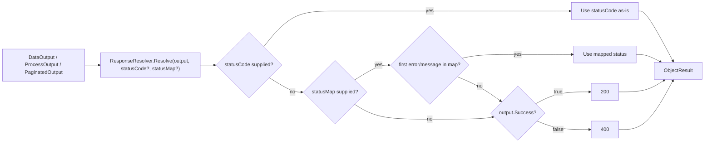

# ResponseResolver Status-Map Implementation Plan

> **For agentic workers:** REQUIRED SUB-SKILL: Use superpowers:subagent-driven-development (recommended) or superpowers:executing-plans to implement this plan task-by-task. Steps use checkbox (`- [ ]`) syntax for tracking.

**Goal:** Let callers optionally pass a map from an envelope's first error/message to an HTTP status code, so `ResponseResolver.Resolve` can pick a specific status without the action branching on strings — while preserving today's behavior when nothing is passed.

**Architecture:** Add one optional trailing `IReadOnlyDictionary<string, int>? statusMap` parameter to each of the three `Resolve` overloads. All three envelope types derive from `ProcessOutput`, so a single private helper (`ResolveStatusCode`) does the lookup for all of them. Resolution order: explicit `statusCode` → map → 200/400 default.

**Tech Stack:** C# / .NET 10, ASP.NET Core MVC (`ObjectResult`/`ActionResult<T>`), xUnit, `ArturRios.Output` envelopes.

## Global Constraints

- Target framework: `net10.0`; `LangVersion` latest; `Nullable` enabled; `ImplicitUsings` enabled.
- Tests: xUnit (`[Fact]`), Given-When-Then names (`GivenX_WhenY_ThenZ`), namespace `ArturRios.Util.WebApi.Tests.AspNetCore`.
- Envelope shape (from `ArturRios.Output` 2.0.1): `ProcessOutput` has public `List<string> Messages`, `List<string> Errors`, `bool Success` (true iff `Errors` is empty). `DataOutput<T> : ProcessOutput`; `PaginatedOutput<T> : DataOutput<T>`. Factory: `ProcessOutput.New`, `DataOutput<T>.New`, `PaginatedOutput<T>.New`; fluent `WithError`, `WithMessage`, `WithData`.
- New parameter must be optional and last on every overload (source-compatible with all existing calls).
- Commit messages: lowercase Conventional Commits, imperative mood.
- Do NOT stage the pre-existing unrelated change in `src/ArturRios.Util.WebApi.csproj`; stage only the files each task lists.

---

### Task 1: Add `statusMap` to all three `Resolve` overloads + shared helper

**Files:**
- Modify: `src/AspNetCore/ResponseResolver.cs` (whole file rewritten below)
- Test: `tests/AspNetCore/ResponseResolverTests.cs` (create)

**Interfaces:**
- Consumes: `ArturRios.Output.{ProcessOutput, DataOutput<T>, PaginatedOutput<T>}`; `ArturRios.Util.Http.HttpStatusCodes`; `Microsoft.AspNetCore.Mvc.{ObjectResult, ActionResult}`.
- Produces:
  - `ResponseResolver.Resolve(ProcessOutput, int? statusCode = null, IReadOnlyDictionary<string,int>? statusMap = null) : ActionResult<ProcessOutput>`
  - `ResponseResolver.Resolve<T>(DataOutput<T?>, int? statusCode = null, IReadOnlyDictionary<string,int>? statusMap = null) : ActionResult<DataOutput<T?>>`
  - `ResponseResolver.Resolve<T>(PaginatedOutput<T>, int? statusCode = null, IReadOnlyDictionary<string,int>? statusMap = null) : ActionResult<PaginatedOutput<T>>`
  - private `ResolveStatusCode(ProcessOutput, int?, IReadOnlyDictionary<string,int>?) : int`

- [ ] **Step 1: Write the failing tests**

Create `tests/AspNetCore/ResponseResolverTests.cs`:

```csharp
using ArturRios.Output;
using ArturRios.Util.WebApi.AspNetCore;
using Microsoft.AspNetCore.Mvc;

namespace ArturRios.Util.WebApi.Tests.AspNetCore;

public class ResponseResolverTests
{
    // --- Behavior preserved when no map / no statusCode ---

    [Fact]
    public void GivenSuccessProcessOutput_WhenResolvingWithoutArgs_ThenStatusIs200()
    {
        var output = ProcessOutput.New;

        var result = ResponseResolver.Resolve(output);

        var objectResult = Assert.IsType<ObjectResult>(result.Result);
        Assert.Equal(200, objectResult.StatusCode);
        Assert.Same(output, objectResult.Value);
    }

    [Fact]
    public void GivenFailedProcessOutput_WhenResolvingWithoutArgs_ThenStatusIs400()
    {
        var output = ProcessOutput.New.WithError("boom");

        var result = ResponseResolver.Resolve(output);

        var objectResult = Assert.IsType<ObjectResult>(result.Result);
        Assert.Equal(400, objectResult.StatusCode);
    }

    // --- Explicit statusCode wins over map ---

    [Fact]
    public void GivenExplicitStatusCodeAndMatchingMap_WhenResolving_ThenStatusCodeWins()
    {
        var output = ProcessOutput.New.WithError("not-found");
        var map = new Dictionary<string, int> { ["not-found"] = 404 };

        var result = ResponseResolver.Resolve(output, statusCode: 409, statusMap: map);

        var objectResult = Assert.IsType<ObjectResult>(result.Result);
        Assert.Equal(409, objectResult.StatusCode);
    }

    // --- Map hit on first error (failure) ---

    [Fact]
    public void GivenFailedOutputWhoseFirstErrorIsMapped_WhenResolving_ThenMappedStatusUsed()
    {
        var output = ProcessOutput.New.WithError("not-found").WithError("ignored");
        var map = new Dictionary<string, int> { ["not-found"] = 404 };

        var result = ResponseResolver.Resolve(output, statusMap: map);

        var objectResult = Assert.IsType<ObjectResult>(result.Result);
        Assert.Equal(404, objectResult.StatusCode);
    }

    // --- Map hit on first message (success) ---

    [Fact]
    public void GivenSuccessOutputWhoseFirstMessageIsMapped_WhenResolving_ThenMappedStatusUsed()
    {
        var output = ProcessOutput.New.WithMessage("created");
        var map = new Dictionary<string, int> { ["created"] = 201 };

        var result = ResponseResolver.Resolve(output, statusMap: map);

        var objectResult = Assert.IsType<ObjectResult>(result.Result);
        Assert.Equal(201, objectResult.StatusCode);
    }

    // --- Map miss falls back to default ---

    [Fact]
    public void GivenFailedOutputWhoseFirstErrorIsNotMapped_WhenResolving_ThenFallsBackTo400()
    {
        var output = ProcessOutput.New.WithError("unmapped");
        var map = new Dictionary<string, int> { ["not-found"] = 404 };

        var result = ResponseResolver.Resolve(output, statusMap: map);

        var objectResult = Assert.IsType<ObjectResult>(result.Result);
        Assert.Equal(400, objectResult.StatusCode);
    }

    // --- Empty message list with map present falls back to default ---

    [Fact]
    public void GivenSuccessOutputWithNoMessages_WhenResolvingWithMap_ThenFallsBackTo200()
    {
        var output = ProcessOutput.New;
        var map = new Dictionary<string, int> { ["created"] = 201 };

        var result = ResponseResolver.Resolve(output, statusMap: map);

        var objectResult = Assert.IsType<ObjectResult>(result.Result);
        Assert.Equal(200, objectResult.StatusCode);
    }

    // --- Caller-controlled comparer (case-insensitive) ---

    [Fact]
    public void GivenCaseInsensitiveMap_WhenFirstErrorDiffersInCase_ThenMappedStatusUsed()
    {
        var output = ProcessOutput.New.WithError("Not-Found");
        var map = new Dictionary<string, int>(StringComparer.OrdinalIgnoreCase)
        {
            ["not-found"] = 404
        };

        var result = ResponseResolver.Resolve(output, statusMap: map);

        var objectResult = Assert.IsType<ObjectResult>(result.Result);
        Assert.Equal(404, objectResult.StatusCode);
    }

    // --- Per-envelope wiring: DataOutput ---

    [Fact]
    public void GivenFailedDataOutputWhoseFirstErrorIsMapped_WhenResolving_ThenMappedStatusUsed()
    {
        var output = DataOutput<string?>.New.WithError("conflict");
        var map = new Dictionary<string, int> { ["conflict"] = 409 };

        var result = ResponseResolver.Resolve(output, statusMap: map);

        var objectResult = Assert.IsType<ObjectResult>(result.Result);
        Assert.Equal(409, objectResult.StatusCode);
        Assert.Same(output, objectResult.Value);
    }

    // --- Per-envelope wiring: PaginatedOutput ---

    [Fact]
    public void GivenFailedPaginatedOutputWhoseFirstErrorIsMapped_WhenResolving_ThenMappedStatusUsed()
    {
        var output = PaginatedOutput<string>.New.WithError("forbidden");
        var map = new Dictionary<string, int> { ["forbidden"] = 403 };

        var result = ResponseResolver.Resolve(output, statusMap: map);

        var objectResult = Assert.IsType<ObjectResult>(result.Result);
        Assert.Equal(403, objectResult.StatusCode);
        Assert.Same(output, objectResult.Value);
    }
}
```

- [ ] **Step 2: Run tests to verify they fail**

Run:

```bash
dotnet test tests/ArturRios.Util.WebApi.Tests.csproj --filter "FullyQualifiedName~ResponseResolverTests"
```

Expected: BUILD FAILS — the `Resolve` overloads do not yet accept a `statusMap` argument (compile error CS1739 / no overload takes 3 args).

- [ ] **Step 3: Rewrite `ResponseResolver` to add the parameter and helper**

Replace the entire contents of `src/AspNetCore/ResponseResolver.cs` with:

```csharp
using ArturRios.Output;
using ArturRios.Util.Http;
using Microsoft.AspNetCore.Mvc;

namespace ArturRios.Util.WebApi.AspNetCore;

/// <summary>Converts output envelopes from <c>ArturRios.Output</c> into ASP.NET Core <see cref="ActionResult{TValue}"/>
/// instances. The HTTP status is resolved in order: an explicit <c>statusCode</c>, then a lookup of the envelope's
/// first error (on failure) or first message (on success) in an optional <c>statusMap</c>, then a default of 200 on
/// success and 400 on failure.</summary>
public static class ResponseResolver
{
    /// <summary>Wraps a <see cref="PaginatedOutput{T}"/> in an <see cref="ActionResult{TValue}"/>. The HTTP status is
    /// resolved from <paramref name="statusCode"/>, then <paramref name="statusMap"/>, then the 200/400 default.</summary>
    /// <param name="paginatedOutput">The paginated result envelope to return.</param>
    /// <param name="statusCode">Optional explicit HTTP status code; when supplied it wins over the map and default.</param>
    /// <param name="statusMap">Optional map from the first error (on failure) or first message (on success) to an HTTP
    /// status code. The caller owns the dictionary and its key comparer.</param>
    public static ActionResult<PaginatedOutput<T>> Resolve<T>(PaginatedOutput<T> paginatedOutput,
        int? statusCode = null, IReadOnlyDictionary<string, int>? statusMap = null)
    {
        var httpStatusCode = ResolveStatusCode(paginatedOutput, statusCode, statusMap);

        return new ObjectResult(paginatedOutput) { StatusCode = httpStatusCode };
    }

    /// <summary>Wraps a <see cref="DataOutput{T}"/> in an <see cref="ActionResult{TValue}"/>. The HTTP status is
    /// resolved from <paramref name="statusCode"/>, then <paramref name="statusMap"/>, then the 200/400 default.</summary>
    /// <param name="dataOutput">The result envelope to return.</param>
    /// <param name="statusCode">Optional explicit HTTP status code; when supplied it wins over the map and default.</param>
    /// <param name="statusMap">Optional map from the first error (on failure) or first message (on success) to an HTTP
    /// status code. The caller owns the dictionary and its key comparer.</param>
    public static ActionResult<DataOutput<T?>> Resolve<T>(DataOutput<T?> dataOutput, int? statusCode = null,
        IReadOnlyDictionary<string, int>? statusMap = null)
    {
        var httpStatusCode = ResolveStatusCode(dataOutput, statusCode, statusMap);

        return new ObjectResult(dataOutput) { StatusCode = httpStatusCode };
    }

    /// <summary>Wraps a <see cref="ProcessOutput"/> in an <see cref="ActionResult{TValue}"/>. The HTTP status is
    /// resolved from <paramref name="statusCode"/>, then <paramref name="statusMap"/>, then the 200/400 default.</summary>
    /// <param name="processOutput">The result envelope to return.</param>
    /// <param name="statusCode">Optional explicit HTTP status code; when supplied it wins over the map and default.</param>
    /// <param name="statusMap">Optional map from the first error (on failure) or first message (on success) to an HTTP
    /// status code. The caller owns the dictionary and its key comparer.</param>
    public static ActionResult<ProcessOutput> Resolve(ProcessOutput processOutput, int? statusCode = null,
        IReadOnlyDictionary<string, int>? statusMap = null)
    {
        var httpStatusCode = ResolveStatusCode(processOutput, statusCode, statusMap);

        return new ObjectResult(processOutput) { StatusCode = httpStatusCode };
    }

    private static int ResolveStatusCode(ProcessOutput output, int? statusCode,
        IReadOnlyDictionary<string, int>? statusMap)
    {
        if (statusCode.HasValue)
        {
            return statusCode.Value;
        }

        if (statusMap is not null)
        {
            var key = output.Success ? output.Messages.FirstOrDefault() : output.Errors.FirstOrDefault();

            if (key is not null && statusMap.TryGetValue(key, out var mapped))
            {
                return mapped;
            }
        }

        return GetDefaultStatusCode(output.Success);
    }

    private static int GetDefaultStatusCode(bool success) => success ? HttpStatusCodes.Ok : HttpStatusCodes.BadRequest;
}
```

- [ ] **Step 4: Run tests to verify they pass**

Run:

```bash
dotnet test tests/ArturRios.Util.WebApi.Tests.csproj --filter "FullyQualifiedName~ResponseResolverTests"
```

Expected: PASS — all `ResponseResolverTests` green.

- [ ] **Step 5: Commit**

```bash
git add src/AspNetCore/ResponseResolver.cs tests/AspNetCore/ResponseResolverTests.cs
git commit -m "feat: add status-code map to ResponseResolver.Resolve"
```

---

### Task 2: Update the responses documentation

**Files:**
- Modify: `docs/content/responses.md` (the "Default status mapping" section, its mermaid flowchart, and a new caller example)

**Interfaces:**
- Consumes: the `statusMap` parameter added in Task 1. No code; docs only.
- Produces: nothing consumed by later tasks.

- [ ] **Step 1: Replace the "Default status mapping" section**

In `docs/content/responses.md`, replace the section that currently starts at the `## Default status mapping` heading and runs through the end of its mermaid code block (the block that ends with `` ``` `` after the `Bad --> Result` line) with:

````markdown
## Status resolution order

Every overload also accepts an optional `statusMap` — an
`IReadOnlyDictionary<string, int>` from an envelope message to an HTTP status code — and
resolves its status the same way:

1. **`statusCode` supplied** — used as-is, regardless of the envelope's `Success` value or
   the map.
2. **`statusMap` supplied** — the lookup key is the **first `Errors` entry** when `Success`
   is `false`, or the **first `Messages` entry** when `Success` is `true`. If that key is
   present in the map, its value is used.
3. **Otherwise** — no map, an empty list, or a key not found — defaults to **200** when
   `Success` is `true` and **400** otherwise.

The caller owns the dictionary, so its key comparer controls matching — build it with
`StringComparer.OrdinalIgnoreCase` for case-insensitive keys.


````

- [ ] **Step 2: Add a `statusMap` caller example**

Immediately after the mermaid block added in Step 1 (and before the existing `This means a failed operation...` paragraph), insert:

````markdown
To map specific errors to specific statuses without branching in the action, pass a
`statusMap` keyed on the envelope's first error:

```csharp
var statusMap = new Dictionary<string, int>
{
    ["User not found"] = 404,
    ["Email already registered"] = 409,
};

return ResponseResolver.Resolve(output, statusMap: statusMap);
```
````

- [ ] **Step 3: Verify the docs read correctly**

Read `docs/content/responses.md` and confirm: the resolution order lists all three steps, the mermaid diagram has both the `statusCode` and `statusMap` branches, and both the explicit-`statusCode` example and the new `statusMap` example are present and syntactically valid.

- [ ] **Step 4: Commit**

```bash
git add docs/content/responses.md
git commit -m "docs: document ResponseResolver status map"
```

---

## Self-Review

**Spec coverage:**
- Signature change (optional trailing `statusMap` on all 3 overloads) → Task 1, Step 3. ✓
- Resolution order (statusCode → map → default) → `ResolveStatusCode`, Task 1, Step 3. ✓
- Key selection (first error on failure / first message on success) → `ResolveStatusCode`. ✓
- Shared helper across all three overloads → `ResolveStatusCode(ProcessOutput ...)`. ✓
- Caller-owned comparer → tested (case-insensitive test), documented (Task 2). ✓
- XML doc updates → Task 1, Step 3 (class summary + 3 overloads). ✓
- Docs update (`responses.md` table/flowchart/example) → Task 2. ✓
- Unit tests (all seven spec cases + per-envelope wiring + same-instance body) → Task 1, Step 1. ✓

**Placeholder scan:** No TBD/TODO; every code/test/command step shows full content. ✓

**Type consistency:** `ResolveStatusCode(ProcessOutput, int?, IReadOnlyDictionary<string,int>?)` and the three `Resolve` signatures are used identically in the implementation and referenced consistently by the tests. `HttpStatusCodes.Ok`/`HttpStatusCodes.BadRequest` match the original file. ✓
