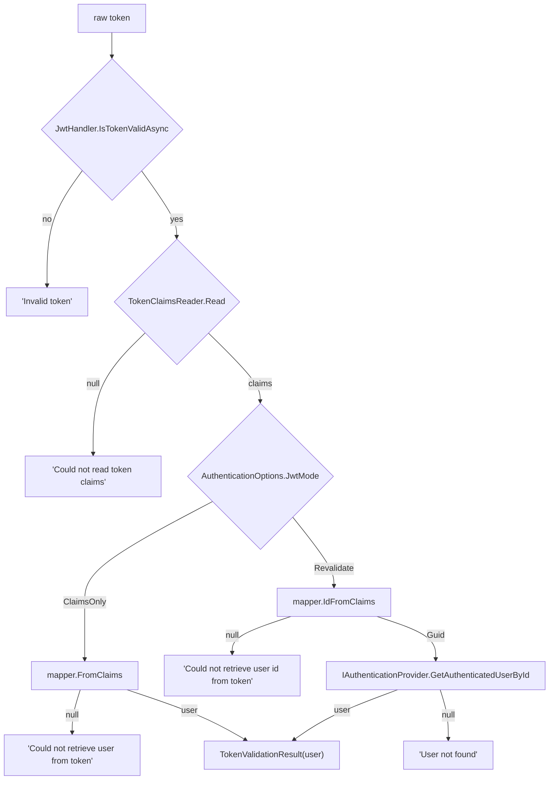

# Caller-defined token claims and authenticated-user shape

**Date:** 2026-07-30
**Status:** Approved (pending written-spec review)

## Goal

Let the consuming app decide **what the authenticated user looks like** and **what claims the token
carries**, while the library keeps just enough knowledge to do its two jobs: resolve a user for a
request, and enforce role-based access.

The library's knowledge of a user shrinks to two properties:

- `Guid Id` — the lookup key for `Revalidate` mode and the provider cache.
- `int RoleId` — the value `RoleRequirementFilter` compares against `[RoleRequirement(params int[])]`.

Everything else — extra properties on the user, extra claims in the token, and the claim keys
themselves — belongs to the caller.

## Background — the current coupling

Identity today is a single closed record, `AuthenticatedUser(string Id, int Role)`, and the library
touches it from eight places:

- [`AuthenticationExtensions.ToTokenClaims`](../../../src/Security/Extensions/AuthenticationExtensions.cs)
  builds the claim dictionary at login.
- [`AuthenticatedUserFactory`](../../../src/Security/Factories/AuthenticatedUserFactory.cs) reads the
  token's claims back into a user (`FromToken`) or just its id (`IdFromToken`).
- [`TokenClaimKeys`](../../../src/Security/Constants/TokenClaimKeys.cs) fixes the claim keys as
  `"id"` and `"role"`.
- [`IAuthenticationProvider`](../../../src/Security/Interfaces/IAuthenticationProvider.cs) and
  [`CachedAuthenticationProvider`](../../../src/Security/Providers/CachedAuthenticationProvider.cs)
  return the concrete record.
- [`TokenValidationResult`](../../../src/Security/Records/TokenValidationResult.cs),
  [`JwtTokenValidator`](../../../src/Security/Authentication/JwtTokenValidator.cs), and
  [`GoogleTokenValidator`](../../../src/Security/Authentication/GoogleTokenValidator.cs) carry it.
- [`AuthorizeAttribute`](../../../src/Security/Attributes/AuthorizeAttribute.cs) and
  [`RoleRequirementFilter`](../../../src/Security/Filters/RoleRequirementFilter.cs) cast
  `HttpContext.Items["User"]` to it; the filter reads `.Role`.

A consuming app therefore cannot add a tenant id, an email, or a permission set to the user without
carrying it separately, and cannot choose its own claim keys.

**Working-tree note.** An uncommitted change in this working tree widened `AuthenticatedUser.Id` from
`int` to `string` (with tests and `security.md` updated, and a new `AuthenticatedUserFactory.IdFromToken`
replacing the upstream `JwtHandler.GetUserIdFromToken`, which returns `int?`). This design supersedes
that: the id becomes a `Guid`, and `IdFromToken` is replaced by the mapper. The implementation folds
that work in rather than reverting it first.

## Success criteria

- A consuming app defines its own user type with arbitrary extra properties, implementing only
  `Guid Id` and `int RoleId`, and gets that type back from `HttpContext.GetUser<MyUser>()`.
- A consuming app defines its own claim keys and extra claims, and a token issued from them
  round-trips through `ClaimsOnly` validation with the extra data intact.
- `Revalidate` mode resolves the user by `Guid` through `IAuthenticationProvider` without the library
  knowing which claim key holds the id.
- `[Authorize]`, `[AllowAnonymous]`, and `[RoleRequirement(params int[])]` keep their current
  signatures and behavior against any caller-defined user type.
- An app that wants none of this registers nothing extra and gets `AuthenticatedUser(Guid, int)` via
  `DefaultAuthenticatedUserMapper`.
- A malformed or hostile token produces a 401 with a message, never an unhandled exception — including
  when the caller's mapper throws.
- `dotnet build`: 0 errors, 0 warnings. `dotnet test`: green, covering the cases in **Testing**.

## Non-goals (YAGNI)

- Multi-valued claims. Claims stay `Dictionary<string, string>`; a caller needing a list encodes it in
  one claim value.
- Generic type parameters threaded through the provider, validators, cache, or middleware. Considered
  and rejected: it buys compile-time typing at the call site in exchange for generics in every
  registration and a closed-generic middleware type in `AddMiddlewares`.
- Migrating to ASP.NET Core's `ClaimsPrincipal`/`AddAuthentication`. The custom middleware stays.
- Role names, role hierarchies, or permission sets. `RoleId` stays a single `int`.
- Changing the Google flow, `TokenExtractor`, `AuthenticationOptions`, or the 401/403 response bodies.
- Backward-compatible shims for the removed APIs. This is a major version.

## Architecture

### The two abstractions

```csharp
// Security/Interfaces/IAuthenticatedUser.cs
public interface IAuthenticatedUser
{
    Guid Id { get; }
    int RoleId { get; }
}

// Security/Records/AuthenticatedUser.cs — the default, for apps needing nothing extra
public record AuthenticatedUser(Guid Id, int RoleId) : IAuthenticatedUser;

// Security/Interfaces/IAuthenticatedUserMapper.cs
public interface IAuthenticatedUserMapper
{
    Dictionary<string, string> ToClaims(IAuthenticatedUser user);

    IAuthenticatedUser? FromClaims(IReadOnlyDictionary<string, string> claims);

    Guid? IdFromClaims(IReadOnlyDictionary<string, string> claims) => FromClaims(claims)?.Id;
}
```

One mapper owns **both** directions, so the claims written at login and the claims read at validation
cannot drift apart. `IdFromClaims` is a default interface implementation: `Revalidate` mode needs only
the id, and a caller whose token carries more than `FromClaims` requires can override it to read the id
claim directly.

`DefaultAuthenticatedUserMapper` ships with the library, maps `Id`/`RoleId` through `TokenClaimKeys`,
and returns an `AuthenticatedUser`. It is both the zero-config path and the reference implementation
the docs point at.

Known wart: because `ToClaims` takes `IAuthenticatedUser`, a mapper that writes extra claims casts its
argument to the app's own type (`((MyUser)user).TenantId`). The cast is safe — the same app owns the
user type, the mapper, and the provider that produced the user — and a generic
`IAuthenticatedUserMapper<TUser>` was rejected under **Non-goals**. The alternative is worse: making
the interface generic pulls `TUser` into the validators and middleware that consume the mapper.

### Claim reading moves out of the factory

`AuthenticatedUserFactory` mixed two responsibilities: reading a JWT's claims (library business) and
interpreting them as a user (caller business). It splits:

- **`TokenClaimsReader`** (`Security/Authentication/TokenClaimsReader.cs`) — static,
  `IReadOnlyDictionary<string, string>? Read(string token)`. The only code that touches
  `JwtSecurityTokenHandler`. Returns `null` for a blank or unreadable token. Does not validate the
  signature; callers must have done that. Repeated claim keys keep the first occurrence and never
  throw.
- **The caller's mapper** — interprets those claims.

`AuthenticatedUserFactory` and `AuthenticationExtensions.ToTokenClaims` are deleted. Claim keys live
only in mappers.

### Removed and replaced

| Removed | Replaced by |
|---|---|
| `AuthenticatedUserFactory.FromToken` | `TokenClaimsReader.Read` + `IAuthenticatedUserMapper.FromClaims` |
| `AuthenticatedUserFactory.IdFromToken` | `TokenClaimsReader.Read` + `IAuthenticatedUserMapper.IdFromClaims` |
| `AuthenticationExtensions.ToTokenClaims(this AuthenticatedUser)` | `IAuthenticatedUserMapper.ToClaims` |

### Incidental cleanup

`HttpContext.Items["User"]` is currently a magic string in four files. It becomes one internal
constant (`AuthenticationItemKeys.User`), with `GetUser()` / `GetUser<TUser>()` as the public way to
read it.

## Components

| Component | Change |
|---|---|
| `IAuthenticatedUser` | **New.** `Guid Id`, `int RoleId`. |
| `AuthenticatedUser` | `record AuthenticatedUser(Guid Id, int RoleId) : IAuthenticatedUser`. |
| `IAuthenticatedUserMapper` | **New.** `ToClaims`, `FromClaims`, `IdFromClaims` (default impl). |
| `DefaultAuthenticatedUserMapper` | **New.** Id/RoleId via `TokenClaimKeys`; `Guid.TryParse`/`int.TryParse`, null on failure. |
| `TokenClaimsReader` | **New.** JWT → claims dictionary, or null. |
| `TokenClaimKeys` | Constant `Role` renamed `RoleId`; **string values unchanged** (`"id"`, `"role"`) so existing tokens still read. Documented as the default mapper's keys. |
| `AuthenticationItemKeys` | **New**, internal. `User = "User"`. |
| `HttpContextExtensions` | **New.** `GetUser()` → `IAuthenticatedUser?`; `GetUser<TUser>()` → `TUser?` where `TUser : IAuthenticatedUser`. |
| `IAuthenticationProvider` | `IAuthenticatedUser? GetAuthenticatedUserById(Guid id)`; `...ByEmail(string email)` returns the interface. |
| `CachedAuthenticationProvider` | Caches `IAuthenticatedUser?`; same key prefixes and TTL semantics. |
| `TokenValidationResult` | `(IAuthenticatedUser? User, string? Error)`. |
| `JwtTokenValidator` | Takes `IAuthenticatedUserMapper`; uses `TokenClaimsReader` + mapper instead of `AuthenticatedUserFactory` and `JwtHandler.GetUserIdFromToken`. |
| `GoogleTokenValidator` | Return type only. |
| `AuthenticationMiddleware` | Attaches via `AuthenticationItemKeys.User`. Otherwise unchanged. |
| `AuthorizeAttribute` | Casts to `IAuthenticatedUser`. Presence check unchanged. |
| `RoleRequirementFilter` | Reads `user.RoleId`. Signature and 403 body unchanged. |
| `RoleRequirementAttribute` | Unchanged. |
| `AuthenticationServiceCollectionExtensions` | `AddTokenAuthentication<TMapper>(...)`; the existing non-generic overload delegates to it with `DefaultAuthenticatedUserMapper`. |
| `AuthenticationOptions`, `TokenExtractor`, `IGoogleTokenVerifier`, `GoogleTokenVerifier`, `GoogleTokenPayload`, `JwtValidationMode`, `TokenSource`, `AllowAnonymousAttribute` | Unchanged. |

## Data flow

### Issuing a token (the caller's login code)

```csharp
var claims = mapper.ToClaims(user);
var token  = jwtHandler.CreateToken(new JwtConfiguration(3600, issuer, audience, secret, claims));
```

### Validating a request

`AuthenticationMiddleware` is unchanged: skip anonymous/Swagger routes, extract one token per
`AuthenticationOptions.Source`, run the enabled validators in registration order, and attach the first
resolved user. Inside `JwtTokenValidator`:



`IAuthenticationProvider` is still resolved per-request from `HttpContext.RequestServices`, so it can
be a scoped service. `GoogleTokenValidator` still resolves by verified email through the same
provider.

### Reading the user in a controller

```csharp
var user   = HttpContext.GetUser<MyUser>();   // null if absent or not that type
var either = HttpContext.GetUser();           // IAuthenticatedUser?
```

### Registration

```csharp
// zero-config: DefaultAuthenticatedUserMapper
services.AddTokenAuthentication(o => { o.JwtMode = JwtValidationMode.Revalidate; });

// caller-defined claims and user type
services.AddTokenAuthentication<MyUserMapper>(o => { o.EnableGoogle = true; /* ... */ });
services.AddCachedAuthenticationProvider<MyAuthenticationProvider>(o => o.Ttl = TimeSpan.FromSeconds(30));
```

The mapper is registered as a singleton, matching the validators.

### A consuming app, end to end

```csharp
public record MyUser(Guid Id, int RoleId, string TenantId) : IAuthenticatedUser;

public class MyUserMapper : IAuthenticatedUserMapper
{
    private const string TenantClaim = "tenant";

    public Dictionary<string, string> ToClaims(IAuthenticatedUser user) =>
        new()
        {
            { TokenClaimKeys.Id, user.Id.ToString() },
            { TokenClaimKeys.RoleId, user.RoleId.ToString() },
            { TenantClaim, ((MyUser)user).TenantId }
        };

    public IAuthenticatedUser? FromClaims(IReadOnlyDictionary<string, string> claims)
    {
        if (!claims.TryGetValue(TokenClaimKeys.Id, out var id) || !Guid.TryParse(id, out var userId) ||
            !claims.TryGetValue(TokenClaimKeys.RoleId, out var role) || !int.TryParse(role, out var roleId))
        {
            return null;
        }

        claims.TryGetValue(TenantClaim, out var tenantId);

        return new MyUser(userId, roleId, tenantId ?? string.Empty);
    }
}
```

## Error handling

Everything expected returns `null` and becomes the existing 401 `ProcessOutput` with a message:
`TokenClaimsReader.Read` for a blank or unreadable token, `FromClaims`/`IdFromClaims` when the claims
cannot produce a user. No new exception types.

The `"Could not read token claims"` branch is defensive: inside `JwtTokenValidator` the signature check
runs first, and a token whose signature validates is by definition readable, so the branch is not
reachable through the validator. It is covered by direct `TokenClaimsReader` tests, not by a validator
test — the implementation plan should not try to reach it through `ValidateAsync`.

Because a mapper is always registered — the default one when the caller supplies none — there is no
"mapper missing" failure mode to guard at startup. `AddTokenAuthentication`'s existing
`ArgumentException` checks (no scheme enabled; Google without client IDs) are unchanged.

**Mapper exceptions are caught.** `JwtTokenValidator` wraps its `FromClaims`/`IdFromClaims` calls and
treats a thrown exception as a validation failure, returning the same error string as a `null` result.
A mapper written with `Guid.Parse` instead of `Guid.TryParse` would otherwise let an attacker turn a
hand-crafted token into a 500 from the exception middleware. The documented contract is still "return
null, don't throw"; this is a backstop at a security boundary. Accepted trade-off: it can mask a
genuinely broken mapper, so the catch is narrow — it wraps only the mapper calls, not the whole
validation path.

## Testing

Naming follows the `Method_Condition_Result` style already used in `tests/Security`.

**New coverage**

- `DefaultAuthenticatedUserMapper`: `ToClaims`/`FromClaims` round-trip; non-`Guid` id → null; blank id
  → null; non-numeric role → null; missing claim → null.
- `TokenClaimsReader`: reads a real token's claims; `null` for `"not-a-jwt"` and for empty; a repeated
  claim key keeps the first occurrence.
- `JwtTokenValidator` with a test mapper carrying an extra `TenantId` claim — the core new guarantee:
  - `ClaimsOnly` returns the caller's own type with the extra property populated.
  - `Revalidate` passes the `Guid` from the claims to the provider.
  - A mapper returning `null` yields the expected error, in both modes.
  - A mapper that **throws** yields an error result, not a propagated exception.
  - An overridden `IdFromClaims` is used in `Revalidate`, asserted by a mapper whose `FromClaims`
    records that it was not called.
- `HttpContextExtensions`: `GetUser<TUser>()` with the right type, with a wrong type → null, with no
  user → null; `GetUser()` returns the interface.
- `AuthorizeAttribute` and `RoleRequirementFilter` driven by a custom user type (authorized role,
  unauthorized role, no user, `[AllowAnonymous]`).
- `AddTokenAuthentication` (non-generic) registers `DefaultAuthenticatedUserMapper`; the generic
  overload registers the caller's mapper.

**Updated coverage**

`AuthenticationMiddlewareTests`, `CachedAuthenticationProviderTests`,
`AuthenticationServiceCollectionExtensionsTests`, `GoogleTokenValidatorTests`,
`RoleRequirementFilterTests`, and `JwtTokenValidatorTests` move to `Guid` ids and interface-typed
stubs. `AuthenticatedUserFactoryTests` is replaced by the mapper and `TokenClaimsReader` tests. The
existing validator-registration-order assertions stay.

## Migration

Breaking for consumers, so `2.1.0` → `3.0.0` in
[`ArturRios.Util.WebApi.csproj`](../../../src/ArturRios.Util.WebApi.csproj).

| Before | After |
|---|---|
| `new AuthenticatedUser(id, role)` | `new AuthenticatedUser(guid, roleId)`, or the app's own `IAuthenticatedUser` |
| `user.Role` | `user.RoleId` |
| `GetAuthenticatedUserById(int id)` | `GetAuthenticatedUserById(Guid id)` returning `IAuthenticatedUser?` |
| `user.ToTokenClaims()` | `mapper.ToClaims(user)` |
| `AuthenticatedUserFactory.FromToken(token)` | `TokenClaimsReader.Read(token)` + `mapper.FromClaims(claims)` |
| `(AuthenticatedUser?)HttpContext.Items["User"]` | `HttpContext.GetUser<MyUser>()` |

Docs to update: [`security.md`](../../content/security.md) (identity types, both JWT modes, caching,
plus a new mapper section), [`architecture.md`](../../content/architecture.md) (the `ClaimsOnly` and
`Revalidate` flow nodes and surrounding prose), and the [README](../../../README.md) security row and
`Revalidate` bullets. The coverage report is regenerated by the normal build-test-publish flow.
